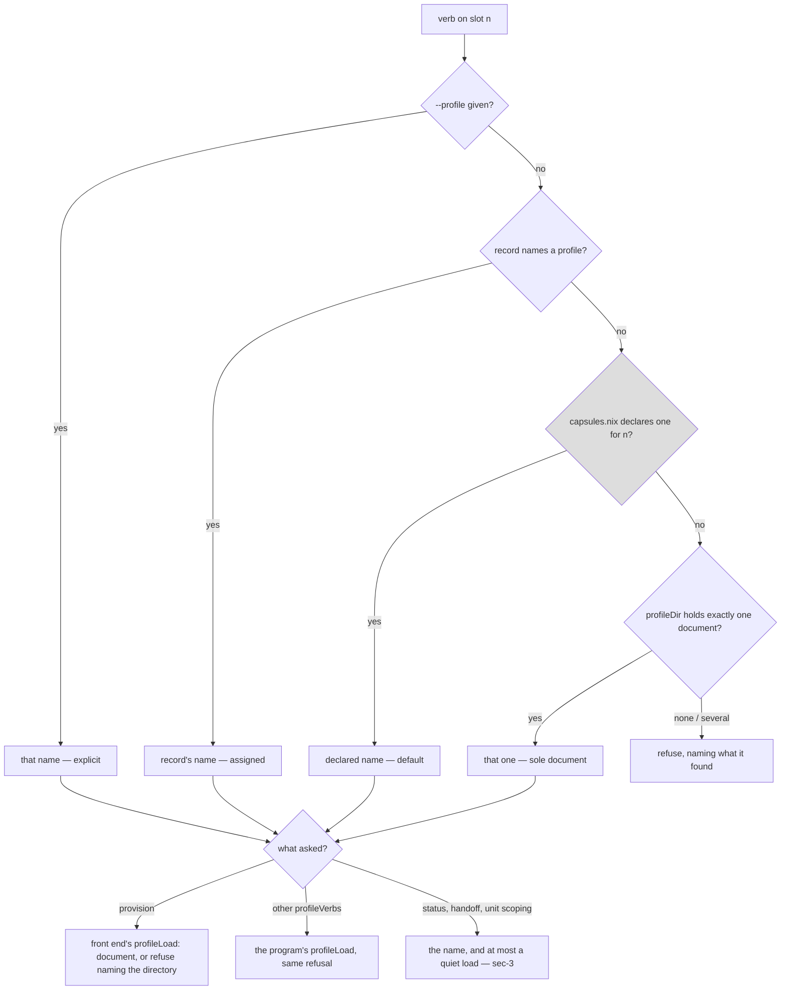
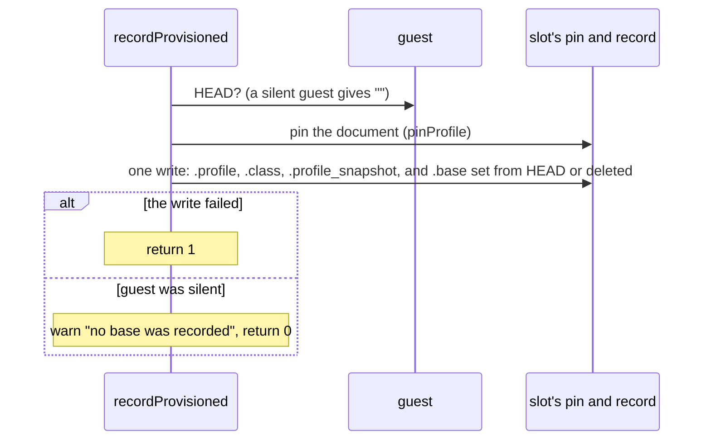
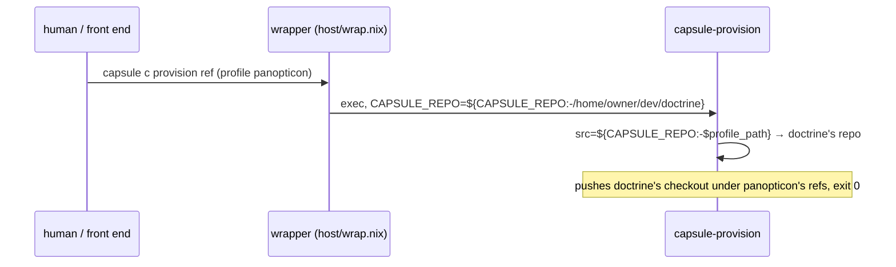
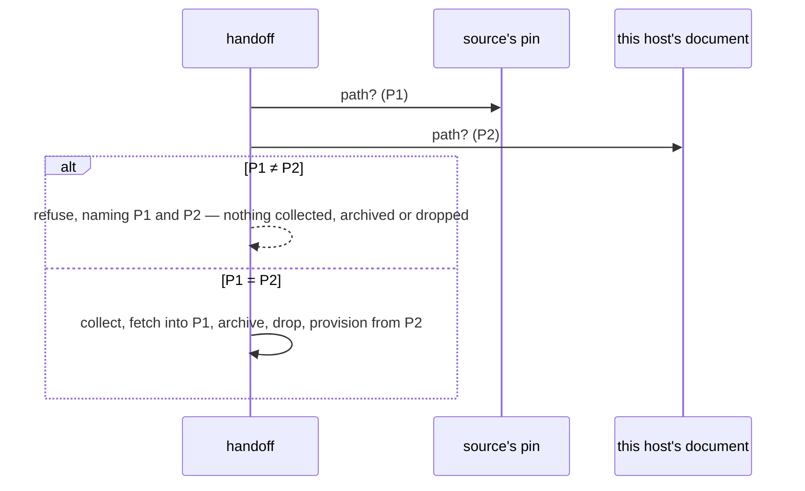

<!-- doctrine:section sec-1 -->
## What changes, and where the boundary sits

**Today**, the `capsule` front end answers *which target is this verb about?* in
three steps (`profileNameFor`, `host/cli.nix`): an explicit `--profile`, then the
slot's assignment record, then — for a slot nothing has assigned — the only
document in the profile directory (`profileNames` lists every `*.json` there,
rendered or hand-written), refusing when there are several. This host has had
two since `IMP-004` (`doctrine.json`, rendered by the module, and
`panopticon.json`, hand-written), so every unassigned slot refuses every
`profileVerb`, and `capsule all status` shows `-` for it.

Separately, on the module path, the wrapper most installed programs run through
(`host/wrap.nix`; `capsule` and `capsule-provision` among them, though not every
installed program is wrapped) supplies `CAPSULE_REPO` from the module's `repo`
option — one target's checkout. Both programs that look up a slot's source repo read
`${CAPSULE_REPO:-$profile_path}`, so the document's `path` is never reached:
a provision or a fetch for any profile uses doctrine's repo (`ISS-008`).

**After this slice:**

1. `capsules.nix` gains a per-slot `profile` — the host operator's declared
   choice of target for a slot nobody has assigned. All ten slots declare
   `doctrine` (`DEC-016`), the only image this host builds. Its *shape* is
   checked at eval; whether a document backs it is not (sec-2).
2. `profileNameFor` gains a step between the record and the sole-document
   fallback: the slot's declared `profile`.
3. The status table's profile cell brackets any answer that is not a record —
   `[doctrine]` — so a default never reads as an assignment (`DEC-014`).
4. A provision resolves its profile **once**, records only a provision that
   completed, and records it with the pin: the name `provisionSlot` resolved is
   the one the program is handed, a program that exits non-zero writes nothing
   and says so, and the record is written in the same step as the pin whether or
   not the guest answers for its HEAD (sec-3). All three are pre-existing
   defects this slice's rules rest on.
5. `-` becomes a reserved profile name, because it is already the front end's
   "absent" value (sec-2).
6. The wrapper stops supplying `CAPSULE_REPO` and the `repo` option is removed
   (`DEC-013`): a target's source is the profile document's `path`, **pinned with
   the rest of the document at provision**, and `CAPSULE_REPO` stays what a
   caller sets on purpose. `docs/contract-assignment.md`'s `source` row changes
   to say so, and `handoff` refuses, before anything destructive, when the
   source's pinned `path` is not this host's (sec-4).
7. Two policies are revised, because each states a rule this slice changes:
   - `POL-002`'s list of places a target's name may appear in code gains one
     entry — a slot's `profile` value in `capsules.nix` — and states the rule
     behind the list (`DEC-012`): generic source never hardcodes a target's
     identity or branches on it; a value the host declares may be threaded into
     a host-specific generated front end, as `slotPolicy` already threads a
     policy name. Its sentence *"No program carries a target's values or its
     name"* gains the same exception.
   - `POL-003`'s slots row gains the per-slot declared profile, and its
     resolution order gains the declared step; its *"the one profile this host
     declares"* becomes *"the only document in the profile directory"*, since
     "declares" now names the new step. The revision says why this is not
     the implicit default the policy forbids: it is declared per slot, in the
     axis's one home, and refuses at use when nothing backs it.

The source half and the default half land together because each makes the other
honest: a slot that defaults to a target whose repo the module path cannot reach
is a provision that pushes the wrong checkout and exits 0.

**Where the boundary sits.** Resolution stays the front end's act (`POL-003`,
`NOTES item 20`): no program reads `capsules.nix` or picks a target. The
declared value is rendered into the front end at build, the same way
`slotPolicy` renders the policy default. The document stays run-time host state
(`NOTES item 52`) and the only thing that can say whether a name is backed.

This diagram shows the resolution order after the change and which source each
answer comes from; the grey node is the new step.



Every verb that acts on its answer reaches `profileLoad` — the front end's for a
provision, the program's for every other `profileVerb` — which is why a declared
name no document backs needs no existence check of its own (`DEC-015`). The
resolver's other callers each decide what an unloadable answer means for them;
sec-3 lists them.

<!-- doctrine:section sec-2 -->
## The declaration: `profile` in `capsules.nix`

**Shape.** One optional field per slot, beside `policy`:

```nix
declared = {
  a = {
    index = 0;
    policy = "build";
    policies = policies.everything;
    profile = "doctrine";
  };
  # … b–j likewise, all "doctrine" (DEC-016)
};

recordOf = name: {
  index,
  policy ? null,
  policies ? [],
  profile ? null,
}: {
  inherit name index policy policies profile;
  # … unchanged
};
```

Optional in `recordOf` for the reason `policy` is: `guardCases`' fixture and
`policyCases`' fixture construct instances that are not slots, and a slot with no
declared profile is a legitimate state — it falls through to the sole-document
step.

**What eval checks, and what it cannot.** Eval checks the name's **shape** and
not its **existence** (`DEC-015` stands):

- *Shape* — a declared profile is refused at eval unless it is non-empty,
  contains no `/`, newline, tab, `$` or backtick, and is not `.`, `..` or `-`.
  That is the grammar `profileLoad` applies at use, plus the reserved `-` below,
  plus four characters that only matter because the name is rendered into the
  front end: a newline or tab would break a line-based consumer, and a `$` or
  backtick inside the single quotes `lib.escapeShellArg` produces is shellcheck's
  `SC2016`, which `writeShellApplication` makes a build failure. Refused at eval,
  the name gets the assertion's message instead of a shellcheck error in a host
  rebuild. It sits beside `undeclared` as a third assertion, `misprofiled`.
- *Existence* — whether a document backs the name. `undeclared` checks `policy`
  against `policies.nix`, but a profile's only authority is a file in
  `profileDir`, which is run-time state outside the store and, for any document
  the module did not render, has no copy in this repo. That check stays at use
  (sec-3).

The grammar belongs to the profile, not to the slots, so the predicate lives in
its own builtins-only file, `host/profile-name.nix`, which `capsules.nix` and
`profileCases` both import. `capsules.nix` exports the check as a function of a
declared set, `misprofiledIn`, so a case can apply the very function the
assertion uses to a fixture set no host declares:

```nix
# host/profile-name.nix
p: p != "" && p != "." && p != ".." && p != "-"
  && builtins.match ".*[/\n\t$`].*" p == null

# capsules.nix
profileNameOk = import ./host/profile-name.nix;
misprofiledIn = declared:
  builtins.filter
  (n: let p = declared.${n}.profile or null; in p != null && !(profileNameOk p))
  (builtins.attrNames declared);
misprofiled = misprofiledIn declared;
```

The grammar still has two spellings — this predicate and `profileLoad`'s `case` —
because one runs at eval and one in the shell. They are held together by a case
that runs one table of names through both and asserts they agree (sec-5), not by
a comment.

**`-` is reserved.** `recordField` (`host/record.nix`) prints `-` for an absent
field, and the whole front end reads `-` as "none" — so a profile named `-`
would read as unassigned, and a slot declaring `-` would read as declaring
nothing. Making `-` out-of-band instead was rejected: it is the front end's
convention everywhere, not only here. So `profileLoad` refuses the name `-`, the
validator refuses a document whose `name` is `-`, the `capsules.nix` assertion
refuses it, and `docs/contract-target.md` says so.

**The warrant, stated in the file.** The comment above `declared` currently
carries *"absence is not a state a perimeter may be in"* for `policy`. That
sentence does not transfer: an unassigned slot with no target is a perfectly
fine state. `profile`'s comment says instead that it is a **convenience** — the
operator saying which client a slot serves when nobody has said otherwise — and
that there is **no `profiles` set**, because
`docs/contract-assignment.md` § *Who may assign* makes an assigner unconstrained
in `profile` by design. It also says that only the name's shape is checked here,
and that `profileLoad` checks the rest, at use.

**The cost of a literal.** The ten `"doctrine"` values repeat `target.nix`'s
`name`. Referring to `target.name` instead was rejected (`DEC-012`: it works for
one target only, and couples the two files). So renaming the target in
`target.nix` leaves every declared slot naming a document that no longer
exists: status shows `[doctrine]`, and every verb on those slots refuses naming
the profile directory — loudly, at use, with the fix in the message.

**Why not `plan-d` §0's objection.** §0 forbids reading meaning out of a slot's
*name*. A declared field is the opposite mechanism: the meaning is written where
it can be read, changed, and refused. Nothing infers `doctrine` from `a`.

**Governance.** Two policies state rules this field changes, and both are revised
with `doctrine revision` inside this slice, landing in the same commit as
`docs/contract-target.md`'s matching sentence.

- `POL-002` says a target's name may appear only in `target.nix` and
  `inputs.target.url`. `DEC-012` revises that sentence to read:

  > A target's name may appear in code (`*.nix`, `*.sh` and the justfile,
  > outside comments, `.doctrine/` and the tool configuration — `.mcp.json`,
  > `.claude/`, `.codex/`) only in `target.nix`, `inputs.target.url`, and as a
  > slot's `profile` value in `capsules.nix`. Generic source never hardcodes a target's
  > identity or branches on it; a host-declared value may be threaded into a
  > generated front end. A case suite's fixture may reproduce a target's layout
  > as data, since a fixture is what a program is run against, not what it is.

  and the sentence *"No program carries a target's values or its name"* gains
  the same exception: *"— except a host-declared value threaded into the
  generated front end."* Leaving it untouched would contradict the first
  change, since `slotDeclaredProfile` is exactly such a value in exactly such a
  program.

  **The list keeps the policy checkable by search**: in those files and outside
  comments, a hit anywhere else is a violation, and the exception is one field of one file, not
  a principle a later change can stretch. Comments are excluded because they
  cite doctrine as history throughout (`host/refresh.nix`, `vm/capsule.nix`),
  and `.doctrine/` and the tool configuration (`.mcp.json`, `.claude/`,
  `.codex/`) are excluded because doctrine is also the tool that governs this
  repo — a name collision, not a leak;
  outside them, today's tree holds the name only in the two places the policy
  already lists, plus case fixtures that build a `.doctrine/` tree as data
  (`host/brief-cases.nix`, `host/state-snapshot-cases.nix`) — which the third
  sentence names, so a hit there is never ambiguous. The
  generated `capsule` program does carry `doctrine` — as `slotPolicy` already
  carries a policy name — but it is built into the store, not written in the
  repo, so the search still holds. **The second sentence gives
  the list its reason**: a revision saying only "programs never carry a target
  name" would be broken by the slice that wrote it, and the policy's own review
  test (*code changed, or only a value?*) is what the sentence states. The
  existing sentence that nothing target-shaped goes in `perimeter/`,
  `vm/capsule.nix` or the justfile is unchanged.
- `POL-003` gives `capsules.nix` "which slots exist and the policy set" and fixes
  resolution as *flag, then record, then the one profile this host declares*.
  The revision adds the per-slot declared profile to the slots row and the
  declared step to the order, renames the last step *the only document in the
  profile directory* (since "declares" now names the new step),
  and states why a per-slot default is not the host-wide implicit default the
  policy forbids: it is declared, per slot, in the axis's one home, and a name
  nothing backs refuses at use rather than resolving to something else.

**Rendering into the front end.** `host/cli.nix` gains `slotDeclaredProfile`,
built like `slotPolicy` from `capsules.instances`, with each name passed through
`lib.escapeShellArg` — the name is spliced into shell text, and unlike a policy
name it is not checked against a declared set at eval, so its shape check does
not make it safe to splice:

```bash
slotDeclaredProfile() {
  case "$1" in
    a) echo 'doctrine' ;;
    # …
    none) echo - ;;   # a fixture slot whose profile is null
    *) echo - ;;
  esac
}
```

One branch per instance, as `slotPolicy` has; a `null` profile renders `-`. The
`*)` branch, which `slotPolicy` does without, is there because an empty echo
would pass the resolver's `!= -` test and resolve to the empty name.

A rendered `case`, not a document read at run time: the declaration is host
config and changes by rebuild, which is what `capsules.nix` is for (`POL-003`,
one home). `-` is the absent value, as `recordField` uses it — which is why it is
reserved above.

<!-- doctrine:section sec-3 -->
## Resolution and the status cell

### `profileNameFor`'s fourth step

Inserted after the record, before the sole-document fallback:

```bash
profileName=$(recordField "$n" profile)
[ "$profileName" != - ] && return 0

profileName=$(slotDeclaredProfile "$n")
[ "$profileName" != - ] && return 0

mapfile -t rendered < <(profileNames)
# … unchanged
```

The function's header comment grows from three sources to four, in the order
authority runs, and says the declared step is the host operator's convenience
and not the front end's latitude — the sole-document step stays the only thing
this front end chooses on its own.

**No existence check here** (`DEC-015`). A declared name that no document backs
resolves. A provision then reaches the front end's own `profileLoad`, and every
other `profileVerb` hands the name to its program, whose `profileLoad` refuses
the same way: `no profile named '<name>' in <dir>`. Objective 3 asks exactly
that. The resolver's other callers are listed below. A check in the resolver
was rejected because `profileCell` maps any resolver
failure to `-`, so a misdeclared slot would read as *nothing* in status rather
than as the name nobody can load.

`profileLoad` changes in two ways (`host/profile.nix`):

- its name `case` refuses `-` beside `.` and `..` (sec-2);
- its second hint line — *"A profile is <name>.json there, rendered from
  target.nix"* — has been false since a document could be hand-written. It
  becomes *"rendered from target.nix by the module, or placed there by hand
  (docs/contract-target.md)"*, and a case asserts the new text.

**Errexit.** `profileCell` captures `profileNameFor` behind `||`, so errexit is
off inside it. The new step is two assignments and a test with no pipeline, and
`slotDeclaredProfile` is a `case` that cannot fail; nothing new can fail
silently. (`mem.fact.oubliette.errexit-skips-a-captured-function`.)

### Every caller of the resolver

A declared default makes an unassigned slot resolve where it used to refuse,
and a misdeclared slot resolve to a name nothing loads. Each caller of
`profileNameFor` (directly, or through `slotProfileName`/`slotProfile`) decides
what those mean for it:

| caller | an unassigned, declared slot | a misdeclared slot |
|---|---|---|
| `work`'s `profileVerb` dispatch | runs under the default | the program refuses at its `profileLoad` |
| `provisionSlot` | provisions under the default and records it | the front end's `profileLoad` refuses; nothing reaches the program |
| `profileCell` (status) | `[name]` | `[name]` — shown, not refused |
| `observe` (status's guest columns) | the row's guest columns fill in, where on a two-document host they were `-` | quiet `-`, as today |
| `repoFor` (`fetch`), `guestStages`, `guestDropState`, `guestHead` | use the default's document — **even when the verb was given another `--profile`**, since these take the slot and not the verb's argv (see below) | refuse, loudly, at `slotProfile` |
| `slotNeedsUnit` | answers 0 or 1 from the default's document — so `unit`, `collect`, `brief` and `setup` now fill or refuse `--unit` as they would for an assigned slot. Intended: the default says which target the slot is for | **new answer 3**, *resolved but will not load* (today it returns 2, *nothing resolved*) |
| `recordUnit` | records or refuses as for an assigned slot | refuses on 3 with `profileLoad`'s message; today it would write the token and exit 0 |
| `unitScope` | fills `--unit` as for an assigned slot | treats 3 as 2 and does not intervene; the program refuses with the better message |
| `handoff` (both slots) | compares the source's profile with the destination's default | resolves; the comparison refuses, or the provision's `profileLoad` does |

The guest-reading row carries a pre-existing defect the default widens. `guestHead`
(through `observed`), `guestStages` and `guestDropState` call `slotProfile "$n"`
with no argv, so they read the slot's record, never the verb's `--profile`.
Today, on a two-document host, an unassigned slot makes them fail quietly. With
a declared default they answer from the default instead, so a first
`provision --profile X` on a slot declaring `Y` reads its HEAD under `Y`'s
`guestPath`, and `setup --profile X --state-from-host` probes `Y`'s state chain.
It is unreachable on this host, where every slot declares the one target the one
image carries; it is `ISS-011`'s class, which is widened to name it, and whose
repair is the same — these three take the profile already resolved rather than
the slot.

`slotNeedsUnit` separates the two failures it used to merge — nothing resolved,
and a name that will not load:

```bash
slotNeedsUnit() {
  local n="$1"
  shift
  slotProfileName "$n" "$@" 2>/dev/null || return 2
  profileLoad "$profileName" >/dev/null 2>&1 || return 3
  profileNeedsUnit
}
```

`unitScope` already reads any non-zero answer as *do not intervene*
(`|| return 0`), so it needs no change. `recordUnit` gains a branch for 3 that
re-runs `profileLoad` for its message and returns 1 without writing.

`handoff`'s refusal when the two differ says *"'b' is on profile X"*; for a
destination answering from its default rather than a record, that reads as an
assignment, which is what `DEC-014` exists to prevent. It says *"'b' declares
X"* instead, decided by the same question the status cell asks — whether the
record names a profile.

### A provision resolves once and records only when it completed, with the pin

Three defects in today's provision path would each make the status rule below
false, so this slice fixes all three. None is caused by the declared default,
but the default makes each easier to reach.

**Once.** `provisionSlot` resolves a profile, holds it in `prof`, and loads it.
It then calls `work … provision`, whose `profileVerb` dispatch
(`host/cli.nix:535`) calls `profileNameFor` again on the original argv. When the
record changes between the two reads, the program pushes under one profile while
the record and pin name the other. The repair: `provisionSlot` forwards the name
it resolved as an explicit `--profile`, prepended for the program alone — the
same way it already prepends `unitScope`'s words — while `recordProvisioned`
still gets the original argv.

**Only when it completed.** `work` ends in a plain `"$prog" …`, not an `exec`,
and `provisionSlot` does not check it. Under errexit that is enough — the plain
`provision` verb dies with the program — but `handoff` calls
`provisionSlot … || exit 1` (`host/cli.nix:2210`), which switches errexit off
inside it, so a failed provision falls through to `recordProvisioned`. The
repair is `|| return 1` on the `work` call, which makes `handoff` behave as the
plain verb already does.

The rule is *a provision that exited non-zero is not recorded*, and that is not
the same as *a push that failed*. `capsule-provision` also exits 1 **after** the
code has landed, when the brief (`briefState`, `briefHostState`) or the refresh
fails. The guest is then at the new commit while the record and the pin still
name the previous assignment — as the plain verb has always left it. Recording
there instead would claim a provision the program itself calls unfinished.
So the front end says what it did not do, once, beside the program's own message:

```bash
local -a given=()
[ "$profileGiven" = yes ] || given=(--profile "$prof")
if ! work "$n" provision ${given[@]+"${given[@]}"} ${scope[@]+"${scope[@]}"} ${1+"$@"}; then
  echo "capsule: nothing was recorded for '$n' by this provision, which did not" >&2
  echo "  complete — the slot's profile, pin and base are as they were. A" >&2
  echo "  provision that completes records them." >&2
  return 1
fi
recordProvisioned "$n" "$prof" ${1+"$@"}
```

`work`'s dispatch then sees a flag, takes the flag step, and adds nothing, so
there is one resolution per provision. A caller's own `--profile` is not
doubled. `unitScope`'s read of the slot's existing record is left alone: it asks
what the *last* assignment scoped, on purpose.

**With the pin.** `recordProvisioned` writes the pin, then asks the guest for
its HEAD, and returns 0 **without writing the record** when the guest does not
answer. That leaves a pin with no record, which `profileDirFor` serves to every
later verb and the status cell below would show as a default. The repair asks
the guest first, so nothing that needs the network sits between the pin and the
record, and then writes the record once:



The write is checked explicitly — `recordWrite … || return 1` — and not left to
errexit, because under `handoff` errexit is off, and an unchecked failure
followed by the silent-guest branch's `return 0` would report success with a pin
and no record, which is the state this reorder exists to remove.

The check alone is not enough, and alone it was the defect (`RV-008` F-6): a
call behind `||` runs with errexit off *inside* it, subshell included. So
`recordWrite` itself (`host/record.nix`) exits on a failed jq or `mv`, rather
than moving an empty file over the record and printing a generation. On
failure the provision says *"provisioned, but could not record it"*.

So a pin has a record naming its profile unless that one file write fails, and
then the provision exits 1 and says so. Only `.base` depends on the guest.
`.base` is deleted, not left, when the guest is silent, because a re-provision
must not keep the *previous* provision's base beside the new profile. One write,
so one generation bump, as today.

`base.ref` is taken as today, from the first original argument, so a
`provision --force <ref>` records `--force` as the ref. That is pre-existing, not
a rule this slice rests on, and is `ISS-012`'s.

A pin already left by an earlier silent provision is not repaired by this; the
status cell below still shows its drift.

### The status cell (`DEC-014`)

| cell | when |
|---|---|
| `-` | nothing resolves (no record, no declaration, and zero or several documents) |
| `[name]` | resolved **without a record**: declared default or sole document |
| `[name]*` | as above, with a pin left by an earlier provision that never recorded, and this host's document has moved on |
| `name` | the record names it, and either its pin agrees with this host's document and with the record, or there is no pin (a record written before pins existed) |
| `name*` | recorded and pinned, and this host's document has moved on |
| `name!` | recorded and pinned, and the pin's bytes are not the ones the record names |

`profileCell` decides brackets by asking one question — whether
`recordField "$n" profile` is `-` — instead of carrying the answer's source out
of the resolver in a variable, which `DEC-015` rejected. The drift markers are
computed the same way either side of that question, so a bracketed name keeps
its `*` when an old record-less pin has drifted. `!` cannot appear in brackets:
it compares the pin against the record's snapshot, and there is no record. A new
record-less pin can arise only from a failed record write, which the provision
reports (above). `DEC-014` states exactly this: brackets never carry `!`, and
carry `*` only for such a pin.

```bash
profileCell() {
  local n="$1" pin host
  useHostProfiles
  profileNameFor "$n" 2>/dev/null || { echo -; return 0; }
  local shown=$profileName
  [ "$(recordField "$n" profile)" != - ] || shown="[$profileName]"
  # … pin / * / ! logic unchanged, printing "$shown" in place of "$profileName"
}
```

**Two columns widen.** The profile field is `%-9s` in `statusFmt`
(`host/cli.nix:1054`), and `[doctrine]` is ten characters, so it would push every
later column right. It becomes `%-11s`, which fits `[doctrine]` and `doctrine*`.
And the header was already misaligned: its label `mem cur/peak` is twelve
characters in the `%-11s` memory column, so every label from `refs` on sits one
column right of its values. That column becomes `%-12s`, in the same edit,
because the new column case measures against the header. `%-Ns` is a
minimum, so a longer name (`[panopticon]` is twelve) still widens its own row,
as a long name does today. The width is a layout choice for short names, not a
fact about any target: nothing branches on it, and a longer name costs its own
row's alignment and nothing else. The
header does not change. `POL-002`'s *"one table over N slots and M targets"* holds,
because the brackets depend on the record and not on any target.

<!-- doctrine:section sec-4 -->
## Source: the document's `path`, and nothing in front of it

### Current behaviour



The same shape governs `capsule <slot> fetch`: the front end itself is wrapped
(`(wrap "capsule" cli)`, `host/services.nix`) and `repoFor` reads
`${CAPSULE_REPO:-$profile_path}`, so a fetch lands in doctrine's repo whatever
the slot runs.

### Target behaviour (`DEC-013`)

`host/wrap.nix`'s `defaults` loses `CAPSULE_REPO`:

```nix
defaults = {
  CAPSULE_STATE = paths.stateDir;
  CAPSULE_POLICY_DIR = paths.policyDir;
  CAPSULE_ALLOWLIST_DIR = paths.allowlistDir;
  CAPSULE_PROFILE_DIR = paths.profileDir;
};
```

Nothing in the two readers changes: `src="${CAPSULE_REPO:-$profile_path}"` and
`repo=${CAPSULE_REPO:-$profile_path}` were already right, and with nothing in
front of them the document answers. A caller who exports `CAPSULE_REPO` still
wins, which `host/git-channel-cases.nix:150` pins and keeps pinning.

**Source is pinned with the profile.** Which document the readers see is the
front end's choice, and it differs by verb: a provision reads this host's
document (`useHostProfiles`), and every later verb — `fetch` through `repoFor`,
`capsule-brief --from-host` through its program — reads the slot's pin
(`profileDirFor`). So `path` is pinned at provision like every other field of
the document. The wrapper's `CAPSULE_REPO` hid this for `fetch` on the module
path; `brief` has always behaved this way. This design keeps it, and says so:

- `docs/contract-assignment.md`'s `source` row changes from *"host declaration,
  keyed by profile — host rebuild"* to *pinned with the profile, per assignment
  generation* — still set by the host operator only, never an assigner.
- A moved checkout is therefore ordinary document drift. After `target.nix`'s
  `path` changes and the host rebuilds, the slot's status reads `doctrine*`,
  `fetch` and `brief` keep using the old path, and a re-provision moves the slot
  to the new one — the same cure as for any other drifted field.

The alternative — `fetch` and `brief` reading `path` live from this host's
document — would match the contract as it was written, but it needs the front
end to hand `brief` a path it does not hand it today, and it splits one
document into a pinned part and a live part.

**`handoff` is the one composition that reads both.** It fetches the source's
work through `fetchSlot`, into the source's **pinned** `path`, then provisions
the destination through `provisionSlot`, which pushes from **this host's**
document. The provision needs the exhibit tip to be in the repo it pushes from,
so the two must be one repo. Until now the wrapper's `CAPSULE_REPO` made them
one; after this slice a moved checkout makes them two, and the provision refuses
*"no commit at <tip>"* — after `handoff` has archived the destination's refs and
dropped its state chain.

So `handoff` checks, beside its existing profile comparison and before it
collects anything: the source's pinned `path` (`slotProfile "$src"`) against
this host's document of the same name (`useHostProfiles`, `profileLoad`). When
they differ it refuses, naming both paths, and says to re-provision the source
from the current checkout (or restore the document's `path`) first. A source
recorded before pins existed reads this host's document either way, so it
passes. `fetch` alone is not affected: it only reads the pin.



The file's header — *"All five, and no exception table"* — becomes four, and
says why this is not the exception table it rejected: the other four have
**baked fallbacks** a program on `$PATH` would get wrong (`$PWD`-relative state,
the store's documents), whereas `CAPSULE_REPO`'s fallback is a value read from
the document the front end just resolved. A default in front of it is not a
default; it is a second answer.

`host/services.nix`: the `repo` option is deleted and `paths` stops passing it.
In its place, `imports = [(lib.mkRemovedOptionModule ["services" "capsule-perimeter" "repo"] "…")]`
with a message naming the replacement: *a target's source is its profile
document's `path`; set `path` in `target.nix`, or `CAPSULE_REPO` for a one-off*.
A host that set the option gets an eval error that says what to do rather than a
silent change of which repo it pushes. `~/flakes` sets no `repo`; its comment
naming it is the user's to edit (outside this repo).

**Prose this makes false.** Several comments and documents say the wrapper
supplies `CAPSULE_REPO`, or count five wrapped directories. Each is corrected in
the same commit as the code:

| where | what it says now |
|---|---|
| `host/git-channel.nix`, above `src=` (lines 127–133) | *"`host/wrap.nix` supplies it as a default now"* |
| `host/cli.nix`, the `moduleState` argument's comment (lines 70–75) | the module path's copy is wrapped with `CAPSULE_STATE` and `CAPSULE_REPO` |
| `host/services.nix`, above `(wrap "capsule" cli)` (lines 797–801) | *"`capsule <name> fetch` writes into `repo`"* |
| `host/services.nix`, lines 777 and 806 | "the five directories" |
| `host/wrap.nix`, header and `paths` comment | "five" |
| `host/wrap-cases.nix`, header and comments (lines 27, 33–34, 73, 113, 166) | "the five" |
| `docs/contract-target.md`, the `name` row (line 75) | `services.capsule-perimeter.repo` as a default derived from the name |
| `CLAUDE.md` (lines ~96 and ~116) | "the wrapper's five directories", "five export lines" |
| `README.md` (line 276) | the wrapper and units supply `CAPSULE_REPO` |
| `README.md` (lines 512–517) | the wrapper's unconditional export is *"a control rather than an oversight"*. The correction says the control was already void once `ISS-004` made the export a default a caller could override, and that source is now chosen by the profile document's author, or by a caller who sets `CAPSULE_REPO` |
| memories `mem.fact.oubliette.wrap-hard-exports-defeat-the-caller`, `mem.fact.oubliette.module-programs-on-path-are-wrappers` | "all five are `${VAR:-default}`"; edited with `doctrine memory edit` |

The list is found by a sweep, not by memory: `grep -rn` for `five`, `cfg.repo`,
`paths.repo`, `capsule-perimeter.repo` and `CAPSULE_REPO` across the repo and
`doctrine memory search` for the same words, **run before the edit** so it is
seen to find today's instances, then again after, when only the readers, the
cases and the sentences that say a caller may set it should remain. `CLAUDE.md`'s
*"five guest-pushed scripts"* is a different five and stays.

**The cost, stated.** `cfg.repo` defaulted under the *owner's* home, so the
module stayed right on a host whose human is not `david`. That property is
lost: the module's own render takes `path` from `target.nix`, which is a
literal. It was only ever right for one target. A host whose checkout lives
elsewhere edits `target.nix`'s `path` or places its own document, and
re-provisions the slots that should follow it.

`capsule-brief --from-host` also reads a checkout (`docs/contract-target.md`'s
`path` row); it reads `$profile_path` from the pin and never consulted
`CAPSULE_REPO`, so the wrapper change does not touch it — it was never subject
to `ISS-008`, and it already behaves as the pinned-source rule above says.

<!-- doctrine:section sec-5 -->
## Code impact and verification

### Code impact

| path | change |
|---|---|
| `host/profile-name.nix` | **new**: the profile-name predicate, builtins only (sec-2) |
| `capsules.nix` | `profile ? null` in `recordOf`; `profile = "doctrine"` on all ten slots; imports the predicate; exports `misprofiledIn`; the `misprofiled` assertion; the comment carrying the warrant (sec-2) |
| `host/cli.nix` | `slotDeclaredProfile` rendered beside `slotPolicy`, escaped, with a `*)` branch; `profileNameFor`'s fourth step and header; `slotNeedsUnit`'s answer 3 and `recordUnit`'s branch for it; `handoff`'s "declares" wording; `profileCell`'s brackets and drift marker; `statusFmt`'s profile column to `%-11s` and memory column to `%-12s`; `provisionSlot` forwards `--profile`, checks `work` and says nothing was recorded; `recordProvisioned` asks HEAD, pins, writes once and checks the write (sec-3); `handoff` refuses when the source's pinned `path` is not this host's; the `moduleState` comment (sec-4) |
| `host/record.nix` | `recordWrite` exits its locked subshell on a failed jq or `mv` (sec-3; `RV-008` F-6) |
| `docs/status.md` | the Now row names the brackets (`DEC-014`) |
| `host/profile.nix` | `profileLoad` refuses `-` and its hint text changes; the validator refuses a document named `-` (sec-2, sec-3) |
| `host/wrap.nix` | `CAPSULE_REPO` leaves `defaults`; header rewritten for four (sec-4) |
| `host/services.nix` | `repo` option removed via `mkRemovedOptionModule`; `paths` loses `repo`; three comments (sec-4) |
| `host/git-channel.nix` | the comment above `src=` (sec-4) |
| `host/policy-cases.nix` | new fixture slots; the stub also writes its argv one bracketed argument per line, and can be told to fail; resolution, unit, handoff, provision, status and fetch cases; the existing cases whose expectations move (below) |
| `host/profile-cases.nix` | the hint; `-` refused by load and validator; the grammar-agreement table; `misprofiledIn` over a fixture set (below) |
| `host/wrap-cases.nix` | takes a declared slot; fixture loses `repo`; the set case becomes four; the composition case; header comments, including why a slot name that is this host's is not a borrowed fixture (below, sec-4) |
| `flake.nix` | `wrapCases` is handed `hostPrograms.provision` and a declared slot, as `gitChannelCases` is, with its "handed a fixture" comment amended; `profileCases` is handed `capsules`; the removed-option check folded into `hostModule`'s `checked`, so no new attribute and no `justfile` change |
| `POL-002`, `POL-003` | revisions (sec-2) |
| `docs/contract-target.md` | `name` row (75), `path` row (76) and `CAPSULE_REPO` row (352) lose the module's `repo` option; `-` is reserved; the resolution paragraph (lines 113–120) gains the declared step, and its *"a target's name therefore appears in a program's text nowhere at all"* gains the generated front end's exception, in `POL-002`'s revised words |
| `docs/contract-assignment.md` | the `profile` row gains *host-declared default per slot, `capsules.nix`* without gaining a set; the `source` row becomes *pinned with the profile, per assignment generation*, and the bullets under the table that describe a live `profile → source` binding follow it; *two host-side overrides* becomes one |
| `docs/plan-d-fleet.md` | L1's *"the cheap insurance was not taken"* — taken, as `profile`; line 380's override list |
| `README.md`, `CLAUDE.md` | the wrapper supplying `CAPSULE_REPO`; "five" directories (sec-4) |
| two memories | "all five"; `doctrine memory edit` (sec-4) |

### Verification

The kinds are not interchangeable (`CLAUDE.md`), and each objective goes to the
kind that can see it. Every case asserts the reason as well as the exit status.

**Third kind — `policyCases`** (the front end's own text over a fixture pool,
with every program a stub that prints its argv and exits 0). Two additions to
the stub: it also writes `out.args`, the argument count and then each argument
in brackets on its own line, as `wrapCases`' stub already prints them, because
`out.argv` is `$*` and cannot tell one argument from two; and it exits 1 when
`CASE_PROGRAM_FAIL` is set, after printing *"the code landed"*, as
`capsule-provision` does when a step after the push fails. Fixture documents
are the suite's existing ones — `solo`, `duo`, and `holed`, whose state paths
have a `{unit}` hole — plus a document whose `path` is the sandbox repo for the
fetch round. The existing slots `none`, `one` and `both` stay **undeclared**,
because existing cases rely on that: *"its neighbour still refuses"* runs on
`one`, and *"an unassigned slot may still record what it is driving"* needs an
unassigned slot with nothing to resolve. New fixture slots carry the
declarations:

| slot | declares | for |
|---|---|---|
| `dflt` | `solo` | resolution, precedence, status, provision |
| `hole` | `holed` | unit scoping |
| `decl` | `unbacked`, which no document backs | the refusals at use, and the ten-character cell |
| `odd` | `a b;touch pwned` | the literal splice — a name shellcheck accepts both quoted and bare, and which runs a command when bare |

Resolution and precedence:

- *an unassigned slot with a declared profile resolves to it on a host with
  several documents* — `dflt collect`, with no flag: the argv carries
  `--profile solo`.
- *the record beats the declaration* — assign `dflt` `duo`; with no flag the
  argv carries `duo`.
- *the flag beats both* — the same slot, with `--profile holed`, carries `holed`.
- *an undeclared unassigned slot still refuses naming every document* — the
  existing cases on `both` and `one`, unchanged.
- *a declared name is spliced literally* — `odd collect`'s `out.args` carries
  `--profile` and then `a b;touch pwned` as **one** argument, and no file
  `pwned` exists in the suite's directory. Unescaped, the rendered branch is
  `echo a b;touch pwned`: it builds, prints `a b`, and creates `pwned`.

Refusal at use. A stub program never loads, so these go through the paths where
the **front end** loads:

- *a misdeclared slot's provision refuses naming the directory* — `decl
  provision <ref>` exits 1, says `no profile named 'unbacked'` and the profiles
  directory, and `out.argv` is empty.
- *a misdeclared slot's unit is not recorded* — `decl unit u1` exits 1 with the
  same message, and the record has no `unit`.
- *a misdeclared slot's collect does not get `--unit` filled in* — answer 3 is
  read as *do not intervene*.

The program's own refusal for a missing document is `profileCases`' (below),
and `gitChannelCases` already runs a real program against a directory.

Other callers:

- *a declared unassigned slot scopes by unit as an assigned one would* —
  `hole unit u1` records, and `hole collect` gets `--unit u1`.
- *handoff to a declared destination says "declares"* — `handoff` from a slot
  recorded `duo` to `dflt` refuses with `'dflt' declares solo`, not `is on`.

Provision (sec-3):

- *a provision's argv, record and pin agree* — `dflt provision <ref>` with no
  flag: the stub's argv carries `--profile solo` exactly once, and the record's
  `profile`, its `class` and the pin's filename all say `solo`. With
  `--profile duo` given, the argv carries it once, not twice. This held before
  the change as well; it is here so the forwarding cannot break it, not as
  proof of the forwarding (see *Not exercised*).
- *a provision that exits non-zero is not recorded* — under `handoff`, so
  errexit is off, with `CASE_PROGRAM_FAIL` set: the exit is 1, the front end
  says nothing was recorded, and the destination's pin digest and record
  `generation` are what they were before the round. (The destination is `one`,
  which earlier rounds pinned, so "no pin file" would be false for correct
  code.) The stub prints *"the code landed"* before failing, so this is also the
  landed-then-failed case.
- *a handoff from a moved checkout refuses before anything destructive* — the
  source pinned under a document whose `path` is the sandbox repo, then this
  host's document of the same name edited to another path: `handoff` exits 1
  naming both paths, `out.argv` shows no `collect`, and the destination's record
  and archive are untouched.
- *a silent guest still leaves a record* — provision `dflt` with the guest
  answering (a base is recorded), then re-provision with the guest silent: exit
  0 with the warning, the record names the profile and the snapshot, `.base` is
  gone, and status shows `solo` bare.
- *a record the write cannot rewrite fails the provision* — a corrupt
  `assignment.json` on `dflt`: exit 1, the provision says it could not record,
  and the record's bytes are unchanged (`RV-008` F-6).

Status:

- *a declared default is bracketed* — `dflt`'s cell is `[solo]`.
- *the sole document is bracketed* — with one document, an unassigned
  undeclared slot reads `[solo]`. The existing assertions that expect a bare
  name for unassigned slots are updated, not deleted.
- *a record is bare, and `*`/`!` still mark it* — the existing cases.
- *a misdeclared slot reads `[unbacked]`, not `-`* — `decl`'s row.
- *a record-less pin keeps its drift marker* — a pin written by hand into an
  unassigned slot's pin directory, with this host's document then edited: the
  cell is `[solo]*`.
- *the header lines up with its rows* — for every column, the header's label
  starts at the same character offset as the row's value. This is what fails
  under the old `%-11s` memory column, and under `%-9s` for the profile on
  `decl`'s row, whose `[unbacked]` is ten characters, as `[doctrine]` is.
- Every status case reads the profile field **by its column** — the characters
  under the header's `profile` label up to the `policy` label — which the
  alignment case makes trustworthy.

Fetch:

- *a fetch with nothing set lands in the document's path* — the existing fetch
  block exports `CAPSULE_REPO`; one new round without it, against the sandbox
  document.

**Third kind — `profileCases`** (`profileLoad` and the validator; handed
`capsules` for the eval-level checks).

- `profileLoad`'s refusal for a missing document carries the new hint text.
- `profileLoad -` refuses as a reserved name; the validator refuses a document
  whose `name` is `-`.
- *one grammar, two spellings* — a table of names (`solo`, `a b;c`, `''`,
  `.`, `..`, `-`, `x/y`, `a$b`, a name containing a backtick, a name containing a
  newline, a name containing a tab)
  goes through `profileNameOk`, read at eval with its verdicts spliced in, and
  through `profileLoad`'s name check in the shell. Each name must be accepted by
  both or refused by both, except the four render-only characters — newline,
  tab, `$` and backtick — which only `profileNameOk` refuses, since they matter
  only to the rendered `case` (sec-2).
- *`misprofiledIn` is the predicate over a set* — `capsules.misprofiledIn` over
  a fixture set `{ good.profile = "solo"; bad.profile = "-"; none = {}; }` is
  `[ "bad" ]`. This pins the exported function, not the assertion that applies
  it to `declared` (see *Not exercised*).

**Fourth kind — `wrapCases`** (the composition). Two changes:

- the *exactly these and no others* case becomes four names — a deliberate edit,
  as its comment requires;
- **new**: *with nothing set, the program's own fallback is reached*. The
  shipped `capsule-provision`, wrapped by the shipped builder over the `plain`
  fixture, run under `env -i` with `CAPSULE_PROFILE_DIR` pointed at a sandbox
  directory holding one document `doc.json` whose `path` is
  `/fixture/doc-repo`, and invoked as `--capsule "$slot" --profile doc` with no
  ref, refuses the missing ref naming `/fixture/doc-repo`. The slot must be one
  this host declares: the direct transport refuses any other `--capsule` before
  `src` is read (`host/guest-ssh.nix`, `direct`). So `wrapCases` is handed
  `slot = head (attrNames capsules.instances)`, exactly as `gitChannelCases` is,
  and its header and `flake.nix`'s comment say that the slot is this host's
  because the program has the declared list baked in, while the paths stay
  nobody's. The copy is `hostPrograms.provision` from the
  flake, the direct-transport one; the module wraps an ssh-transport copy of the
  same text, and the refusal comes before any transport is used, which is what
  `gitChannelCases` already relies on. Watched red against today's `wrap.nix`
  with **today's fixture**, which still has `repo`: there it names
  `/fixture/repo`. With the new fixture, today's `wrap.nix` would fail at eval
  on the missing attribute instead, which proves nothing.

**Eval — the removed option**, folded into `hostModule`'s `checked` in
`flake.nix`, the gate both `hostModuleUnits` and `hostModulePrograms` already
pass through. A new flake attribute would also need adding to the `justfile`'s
`build` recipe, which lists every attribute by hand — `NOTES item 51` step 3 is
what happens when that is forgotten — whereas `checked` is already in
`just build` twice. `hostModuleUnits`' fixture never sets `repo`, so it cannot
see the shim. The check evaluates the module a second time with `repo` set, and
`checked` throws, naming which of two checks failed, each under its own
`builtins.tryEval`:

1. `options.services.capsule-perimeter ? repo` is true. With the shim deleted or
   misnamed, the module system's unmatched-definition check makes reading
   `options` throw, so this check reports *options unreadable* — distinguishable
   from an eval that merely failed.
2. One entry in `config.assertions` fails with a message naming the profile
   document's `path`. `mkRemovedOptionModule` reports through
   `config.assertions`, so the message is readable at eval.

**Unchanged and must stay green**: `gitChannelCases`' *CAPSULE_REPO still beats
the document* (line 150); `hostModuleUnits`.

**Mutations to run** (`mem.pattern.oubliette.a-mutation-must-reach-the-case`):

| mutation | expected red |
|---|---|
| drop the fourth step | the declared-resolution cases; the undeclared refusals stay green |
| move the declared step ahead of the record | *the record beats the declaration* |
| move the declared step ahead of the flag | *the flag beats both* |
| drop `lib.escapeShellArg` from `slotDeclaredProfile` | the literal case: `out.args` splits and `pwned` exists |
| drop the `*)` branch | none: every fixture slot is rendered, so no fixture reaches it. Recorded as not exercised |
| collapse `slotNeedsUnit`'s answer 3 into 2 | *a misdeclared slot's unit is not recorded* |
| drop the "declares" wording | the handoff case |
| drop the bracket | the status cases |
| return early for a bracketed name, skipping the drift logic | *a record-less pin keeps its drift marker* |
| leave either column at its old width | the alignment case |
| forward `--profile` even when the caller gave one | *a provision's argv, record and pin agree* (two flags) |
| drop the check on `work`'s status | *a provision that exits non-zero is not recorded* |
| drop `recordWrite`'s own exit on a failed jq | *a record the write cannot rewrite fails the provision* — a corrupt record is the seam |
| drop `handoff`'s path comparison | *a handoff from a moved checkout refuses before anything destructive* |
| let `$` through `profileNameOk` | the grammar-agreement case, on `a$b` |
| ask HEAD after the pin and skip the record when silent, as today | *a silent guest still leaves a record* |
| leave `.base` in place when the guest is silent | the same case, on `.base` |
| let `-` through `profileLoad` | the reserved-name case and the grammar-agreement case |
| make `misprofiledIn` read `.profiles` | *`misprofiledIn` is the predicate over a set* |
| revert the hint | the hint case |
| put `CAPSULE_REPO` back in `defaults` (with today's fixture) | the composition case and the set case |
| delete or misname the shim; separately, drop its replacement text | `just build` fails at `checked`, naming its first check and then its second |

**Not exercised here, and said so.** The race the forwarded `--profile` closes —
the record changing between two reads in one process — is not driven: no seam in
the front end's text sits between them, and adding one only to test it would be
a seam for its own sake. Removing the forwarding therefore turns no case red,
because `work` would re-resolve to the same name in a sandbox where nothing
changes the record. The fix is held by its own text and the comment beside it.

One more is held by its text alone: the `misprofiled` **assertion** — that
`capsules.nix` applies `misprofiledIn` to its own `declared` and throws — is not
driven, as `undeclared`'s assertion is not today: `profileCases` pins the
function it applies, and deleting the `assert` line turns nothing red. And of
`recordWrite`'s two exits, only the jq one is driven; a failed `mv` is not.

There is no live provision on a second target; `IMP-006` and `CHR-011` own that.
The user checks the live host after the switch with two commands that push
nothing:

- `capsule all status` — brackets, alignment, and the declared default on every
  unassigned slot;
- `capsule <slot> provision --profile panopticon`, with **no ref**, on an
  unassigned slot that is **started** and is not `c` (the slot driving
  doctrine's `SL-251`). Started, because the module's copy reaches its guest
  through the relay socket (`viaSocket`), which exists only while the slot is up
  and is checked before argument parsing — on a stopped slot the refusal is
  *"no way in"*, which names no path. `capsule-provision` refuses a missing ref after resolving `src` and
  before any push, naming `src` in the message (`host/git-channel.nix`, after
  argument parsing), so the refusal should name panopticon's `path`, not
  doctrine's. That is `ISS-008`'s closure on the module path. With `work`'s
  failure checked, nothing is pinned or recorded.

