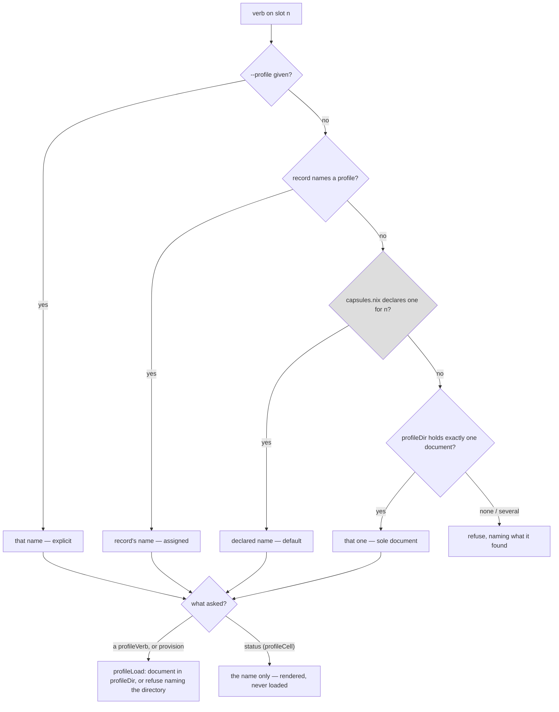
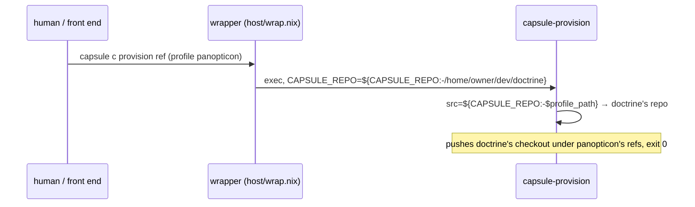

<!-- doctrine:section sec-1 -->
## What changes, and where the boundary sits

**Today**, the `capsule` front end answers *which target is this verb about?* in
three steps (`profileNameFor`, `host/cli.nix`): an explicit `--profile`, then the
slot's assignment record, then — for a slot nothing has assigned — the only
document in the profile directory (`profileNames` lists every `*.json` there,
rendered or hand-written), refusing when there are several. This host has had
two since `IMP-004` (`doctrine.json`, rendered by the module, and
`panopticon.json`, hand-written), so every unassigned slot refuses every
`profileVerb`, and `capsule all status` shows `-` for it.

Separately, on the module path, the wrapper most installed programs run through
(`host/wrap.nix`; `capsule` and `capsule-provision` among them, though not every
installed program is wrapped) supplies `CAPSULE_REPO` from the module's `repo`
option — one target's checkout. Both programs that look up a slot's source repo read
`${CAPSULE_REPO:-$profile_path}`, so the document's `path` is never reached:
a provision or a fetch for any profile uses doctrine's repo (`ISS-008`).

**After this slice:**

1. `capsules.nix` gains a per-slot `profile` — the host operator's declared
   choice of target for a slot nobody has assigned. All ten slots declare
   `doctrine` (`DEC-016`), the only image this host builds. Its *shape* is
   checked at eval; whether a document backs it is not (sec-2).
2. `profileNameFor` gains a step between the record and the sole-document
   fallback: the slot's declared `profile`.
3. The status table's profile cell brackets any answer that is not a record —
   `[doctrine]` — so a default never reads as an assignment (`DEC-014`).
4. A provision resolves its profile **once** and records it with the pin: the
   name `provisionSlot` resolved is the one the program is handed, and the record
   is written beside the pin whether or not the guest then answers for its HEAD
   (sec-3). Both are pre-existing defects this slice's rules rest on.
5. `-` becomes a reserved profile name, because it is already the front end's
   "absent" value (sec-2).
6. The wrapper stops supplying `CAPSULE_REPO` and the `repo` option is removed
   (`DEC-013`): the profile document's `path` is the one home of a target's
   source on this host, and `CAPSULE_REPO` stays what a caller sets on purpose.
7. Two policies are revised, because each states a rule this slice changes:
   - `POL-002` is reworded by **provenance and mechanism** (`DEC-012`): generic
     source never hardcodes or branches on a target's identity; a value the host
     declares may be threaded into a host-specific generated front end, as
     `slotPolicy` already threads a policy name.
   - `POL-003`'s slots row gains the per-slot declared profile, and its
     resolution order gains the declared step. The revision says why this is not
     the implicit default the policy forbids: it is declared per slot, in the
     axis's one home, and refuses at use when nothing backs it.

The source half and the default half land together because each makes the other
honest: a slot that defaults to a target whose repo the module path cannot reach
is a provision that pushes the wrong checkout and exits 0.

**Where the boundary sits.** Resolution stays the front end's act (`POL-003`,
`NOTES item 20`): no program reads `capsules.nix` or picks a target. The
declared value is rendered into the front end at build, the same way
`slotPolicy` renders the policy default. The document stays run-time host state
(`NOTES item 52`) and the only thing that can say whether a name is backed.

This diagram shows the resolution order after the change and which source each
answer comes from; the grey node is the new step.



Every verb that acts on its answer reaches `profileLoad`, which is why a
declared name no document backs needs no existence check of its own
(`DEC-015`, sec-3). The status cell resolves without loading, which is why a
misdeclared slot shows its name there rather than a refusal.

<!-- doctrine:section sec-2 -->
## The declaration: `profile` in `capsules.nix`

**Shape.** One optional field per slot, beside `policy`:

```nix
declared = {
  a = {
    index = 0;
    policy = "build";
    policies = policies.everything;
    profile = "doctrine";
  };
  # … b–j likewise, all "doctrine" (DEC-016)
};

recordOf = name: {
  index,
  policy ? null,
  policies ? [],
  profile ? null,
}: {
  inherit name index policy policies profile;
  # … unchanged
};
```

Optional in `recordOf` for the reason `policy` is: `guardCases`' fixture and
`policyCases`' fixture construct instances that are not slots, and a slot with no
declared profile is a legitimate state — it falls through to the sole-document
step.

**What eval checks, and what it cannot.** Eval checks the name's **shape** and
not its **existence** (`DEC-015` stands):

- *Shape* — a declared profile is refused at eval unless it is non-empty,
  contains no `/`, newline or tab, and is not `.`, `..` or `-`. That is the
  grammar `profileLoad` applies at use (plus the reserved `-` below, plus the two
  characters that would break a line-based consumer), refused before it can reach
  a host. It sits beside `undeclared` as a third assertion, `misprofiled`, and its
  predicate `profileNameOk` is exported beside `recordOf` so a case can apply it to
  names no real slot declares (sec-5).
- *Existence* — whether a document backs the name. `undeclared` checks `policy`
  against `policies.nix`, but a profile's only authority is a file in
  `profileDir`, which is run-time state outside the store and, for any document
  the module did not render, has no copy in this repo. That check stays at use
  (sec-3).

```nix
profileNameOk = p:
  p != "" && p != "." && p != ".." && p != "-"
  && builtins.match ".*[/\n\t].*" p == null;

misprofiled =
  builtins.filter
  (n: let p = declared.${n}.profile or null; in p != null && !(profileNameOk p))
  names;
```

The grammar now has two spellings — this predicate and `profileLoad`'s `case` —
because one runs at eval and one in the shell. They are held together by a case
that runs one table of names through both and asserts they agree (sec-5), not by
a comment.

**`-` is reserved.** `recordField` (`host/record.nix`) prints `-` for an absent
field, and the whole front end reads `-` as "none" — so a profile named `-`
would read as unassigned, and a slot declaring `-` would read as declaring
nothing. Making `-` out-of-band instead was rejected: it is the front end's
convention everywhere, not only here. So `profileLoad` refuses the name `-`, the
validator refuses a document whose `name` is `-`, the `capsules.nix` assertion
refuses it, and `docs/contract-target.md` says so.

**The warrant, stated in the file.** The comment above `declared` currently
carries *"absence is not a state a perimeter may be in"* for `policy`. That
sentence does not transfer: an unassigned slot with no target is a perfectly
fine state. `profile`'s comment says instead that it is a **convenience** — the
operator saying which client a slot serves when nobody has said otherwise — and
that there is **no `profiles` set**, because
`docs/contract-assignment.md` § *Who may assign* makes an assigner unconstrained
in `profile` by design. It also says that only the name's shape is checked here,
and that `profileLoad` checks the rest, at use.

**Why not `plan-d` §0's objection.** §0 forbids reading meaning out of a slot's
*name*. A declared field is the opposite mechanism: the meaning is written where
it can be read, changed, and refused. Nothing infers `doctrine` from `a`.

**Governance.** Two policies state rules this field changes, and both are revised
with `doctrine revision` inside this slice, landing in the same commit as
`docs/contract-target.md`'s matching sentence.

- `POL-002` says a target's name may appear only in `target.nix` and
  `inputs.target.url`. `DEC-012` rewords it by where a name comes from rather than
  where it ends up: **generic source never hardcodes a target's identity or
  branches on it; a value the host declares may be threaded into a host-specific
  generated front end**. That wording matters because this design does put
  `doctrine` into the generated `capsule` program — as `slotPolicy` already puts a
  policy name there — so a revision saying "programs never carry a target name"
  would be broken by the slice that wrote it. The policy's own review test
  (*code changed, or only a value?*) is what the new wording states. `DEC-012`'s
  text calls the name a "key" in a host declaration; in `capsules.nix` it is a
  **value**, and the record is corrected to say so.
- `POL-003` gives `capsules.nix` "which slots exist and the policy set" and fixes
  resolution as *flag, then record, then the one document*. The revision adds the
  per-slot declared profile to the slots row and the declared step to the order,
  and states why a per-slot default is not the host-wide implicit default the
  policy forbids: it is declared, per slot, in the axis's one home, and a name
  nothing backs refuses at use rather than resolving to something else.

**Rendering into the front end.** `host/cli.nix` gains `slotDeclaredProfile`,
built like `slotPolicy` from `capsules.instances`, with each name passed through
`lib.escapeShellArg` — the name is spliced into shell text, and unlike a policy
name it is not checked against a declared set at eval, so its shape check does
not make it safe to splice:

```bash
slotDeclaredProfile() {
  case "$1" in
    a) echo 'doctrine' ;;
    # …
    none) echo - ;;   # a fixture slot whose profile is null
  esac
}
```

One branch per instance, as `slotPolicy` has; a `null` profile renders `-`.

A rendered `case`, not a document read at run time: the declaration is host
config and changes by rebuild, which is what `capsules.nix` is for (`POL-003`,
one home). `-` is the absent value, as `recordField` uses it — which is why it is
reserved above.

<!-- doctrine:section sec-3 -->
## Resolution and the status cell

### `profileNameFor`'s fourth step

Inserted after the record, before the sole-document fallback:

```bash
profileName=$(recordField "$n" profile)
[ "$profileName" != - ] && return 0

profileName=$(slotDeclaredProfile "$n")
[ "$profileName" != - ] && return 0

mapfile -t rendered < <(profileNames)
# … unchanged
```

The function's header comment grows from three sources to four, in the order
authority runs, and says the declared step is the host operator's convenience
and not the front end's latitude — the sole-document step stays the only thing
this front end chooses on its own.

**No existence check here** (`DEC-015`). A declared name that no document backs
resolves. Every verb that acts on the answer then reaches `profileLoad`, which
refuses with `no profile named '<name>' in <dir>`; objective 3 asks exactly
that. The status cell resolves and never loads, so it shows the name (below). A
check in the resolver was rejected because `profileCell` maps any resolver
failure to `-`, so a misdeclared slot would read as *nothing* in status rather
than as the name nobody can load.

`profileLoad` changes in two ways (`host/profile.nix`):

- its name `case` refuses `-` beside `.` and `..` (sec-2);
- its second hint line — *"A profile is <name>.json there, rendered from
  target.nix"* — has been false since a document could be hand-written. It
  becomes *"rendered from target.nix by the module, or placed there by hand
  (docs/contract-target.md)"*, and a case asserts the new text.

**Errexit.** `profileCell` captures `profileNameFor` behind `||`, so errexit is
off inside it. The new step is two assignments and a test with no pipeline, and
`slotDeclaredProfile` is a `case` that cannot fail; nothing new can fail
silently. (`mem.fact.oubliette.errexit-skips-a-captured-function`.)

### A provision resolves once and records what it pinned

Two defects in today's provision path would each make the status rule below
false, so this slice fixes both. Neither is caused by the declared default, but
the declared default makes both easier to reach.

**Once.** `provisionSlot` resolves a profile, holds it in `prof`, and loads it.
It then calls `work … provision`, whose `profileVerb` dispatch
(`host/cli.nix:535`) calls `profileNameFor` again on the original argv. When the
record changes between the two reads, the program pushes under one profile while
the record and pin name the other. The repair: `provisionSlot` forwards the name
it resolved as an explicit `--profile`, prepended for the program alone — the
same way it already prepends `unitScope`'s words — while `recordProvisioned`
still gets the original argv:

```bash
local -a given=()
[ "$profileGiven" = yes ] || given=(--profile "$prof")
work "$n" provision ${given[@]+"${given[@]}"} ${scope[@]+"${scope[@]}"} ${1+"$@"}
recordProvisioned "$n" "$prof" ${1+"$@"}
```

`work`'s dispatch then sees a flag, takes the flag step, and adds nothing, so
there is one resolution per provision. A caller's own `--profile` is not
doubled. `unitScope`'s read of the slot's existing record is left alone: it asks
what the *last* assignment scoped, on purpose.

**With the pin.** `recordProvisioned` writes the pin, then asks the guest for
its HEAD, and returns 0 **without writing the record** when the guest does not
answer. That leaves a pin with no record. `profileDirFor` serves that pin to
every later verb, and the status cell below would show it as a default. The
repair moves the record write to follow the pin directly, before the one
question that needs a live guest:

```mermaid
sequenceDiagram
  participant R as recordProvisioned
  participant S as slot's record and pin
  participant G as guest
  R->>S: pin the document (pinProfile)
  R->>S: record .profile, .class, .profile_snapshot; clear .base
  R->>G: HEAD?
  alt answers
    R->>S: record .base = {ref, oid}
  else silent
    Note over R: warn "no base was recorded", return 0
  end
```

So a pin always has a record naming its profile, and only `.base` waits on the
guest. `.base` is cleared in the first write because a re-provision whose guest
is silent must not leave the *previous* provision's base beside the new profile.
The cost is two writes, so two generation bumps, where there was one. Every
mutation already bumps the generation, and nothing reads the gap between two
bumps.

A pin already left by an earlier silent provision is not repaired: it reads as a
bracketed default until that slot's next provision writes the record.

### The status cell (`DEC-014`)

| cell | when |
|---|---|
| `-` | nothing resolves (no record, no declaration, and zero or several documents) |
| `[name]` | resolved **without a record**: declared default or sole document |
| `name` | the record names it, and either its pin agrees with this host's document and with the record, or there is no pin (a record written before pins existed) |
| `name*` | recorded and pinned, and this host's document has moved on |
| `name!` | recorded and pinned, and the pin's bytes are not the ones the record names |

`profileCell` decides brackets by asking one question — whether
`recordField "$n" profile` is `-` — instead of carrying the answer's source out
of the resolver in a variable, which `DEC-015` rejected. Brackets never carry
`*` or `!`, because a provision now writes the record directly after the pin, so
no new pin exists without a record.

```bash
profileCell() {
  local n="$1" pin host
  useHostProfiles
  profileNameFor "$n" 2>/dev/null || { echo -; return 0; }
  if [ "$(recordField "$n" profile)" = - ]; then
    echo "[$profileName]"
    return 0
  fi
  # … pin / * / ! logic unchanged
}
```

**The column widens.** The profile field is `%-9s` in `statusFmt`
(`host/cli.nix:1054`), and `[doctrine]` is ten characters, so it would push every
later column right. It becomes `%-11s`, which also fits `doctrine*`. `%-Ns` is a
minimum, so a longer name (`[panopticon]` is twelve) still widens its own row,
as a long name does today; the width serves the default this host declares. The
header does not change. `POL-002`'s *"one table over N slots and M targets"* holds,
because the brackets depend on the record and not on any target.

<!-- doctrine:section sec-4 -->
## Source: the document's `path`, and nothing in front of it

### Current behaviour



The same shape governs `capsule <slot> fetch`: the front end itself is wrapped
(`(wrap "capsule" cli)`, `host/services.nix`) and `repoFor` reads
`${CAPSULE_REPO:-$profile_path}`, so a fetch lands in doctrine's repo whatever
the slot runs.

### Target behaviour (`DEC-013`)

`host/wrap.nix`'s `defaults` loses `CAPSULE_REPO`:

```nix
defaults = {
  CAPSULE_STATE = paths.stateDir;
  CAPSULE_POLICY_DIR = paths.policyDir;
  CAPSULE_ALLOWLIST_DIR = paths.allowlistDir;
  CAPSULE_PROFILE_DIR = paths.profileDir;
};
```

Nothing in the two readers changes: `src="${CAPSULE_REPO:-$profile_path}"` and
`repo=${CAPSULE_REPO:-$profile_path}` were already right, and with nothing in
front of them the document answers. A caller who exports `CAPSULE_REPO` still
wins, which `host/git-channel-cases.nix:150` pins and keeps pinning.

The file's header — *"All five, and no exception table"* — becomes four, and
says why this is not the exception table it rejected: the other four have
**baked fallbacks** a program on `$PATH` would get wrong (`$PWD`-relative state,
the store's documents), whereas `CAPSULE_REPO`'s fallback is a value read from
the document the front end just resolved. A default in front of it is not a
default; it is a second answer.

`host/services.nix`: the `repo` option is deleted and `paths` stops passing it.
In its place, `imports = [(lib.mkRemovedOptionModule ["services" "capsule-perimeter" "repo"] "…")]`
with a message naming the replacement: *a target's source is its profile
document's `path`; set `path` in `target.nix`, or `CAPSULE_REPO` for a one-off*.
A host that set the option gets an eval error that says what to do rather than a
silent change of which repo it pushes. `~/flakes` sets no `repo`; its comment
naming it is the user's to edit (outside this repo).

**Prose this makes false.** Several comments and documents say the wrapper
supplies `CAPSULE_REPO`, or count five wrapped directories. Each is corrected in
the same commit as the code:

| where | what it says now |
|---|---|
| `host/git-channel.nix`, above `src=` (lines 127–133) | *"`host/wrap.nix` supplies it as a default now"* |
| `host/cli.nix`, the `moduleState` argument's comment (lines 70–75) | the module path's copy is wrapped with `CAPSULE_STATE` and `CAPSULE_REPO` |
| `host/services.nix`, above `(wrap "capsule" cli)` (lines 797–801) | *"`capsule <name> fetch` writes into `repo`"* |
| `host/wrap.nix`, header and `paths` comment | "five" |
| `CLAUDE.md` (lines ~96 and ~116) | "the wrapper's five directories", "five export lines" |
| `README.md` (lines 276, 513–515) | the wrapper and units supply `CAPSULE_REPO` |

The list is found by a sweep, not by memory: `grep -rn` for `five`, `cfg.repo`,
`paths.repo` and `CAPSULE_REPO` across the repo, **run before the edit** so it is
seen to find today's instances, then again after, when only the readers, the
cases and the sentences that say a caller may set it should remain. `CLAUDE.md`'s
*"five guest-pushed scripts"* is a different five and stays.

**The cost, stated.** `cfg.repo` defaulted under the *owner's* home, so the
module stayed right on a host whose human is not `david`. That property is
lost: the module's own render takes `path` from `target.nix`, which is a
literal. It was only ever right for one target, and `docs/contract-assignment.md`
already names source as *host declaration, keyed by profile* — which the document
in `profileDir` is. A host whose checkout lives elsewhere edits `target.nix`'s
`path` or places its own document.

`capsule-brief --from-host` also reads a checkout (`docs/contract-target.md`'s
`path` row); it reads `$profile_path` directly and never consulted
`CAPSULE_REPO`, so it is unaffected — and was never subject to `ISS-008`.

<!-- doctrine:section sec-5 -->
## Code impact and verification

### Code impact

| path | change |
|---|---|
| `capsules.nix` | `profile ? null` in `recordOf`; `profile = "doctrine"` on all ten slots; `profileNameOk` exported and the `misprofiled` assertion; the comment carrying the warrant (sec-2) |
| `host/cli.nix` | `slotDeclaredProfile` rendered beside `slotPolicy`, escaped; `profileNameFor`'s fourth step and header; `profileCell` brackets and `%-11s`; `provisionSlot` forwards `--profile`; `recordProvisioned` records with the pin (sec-3); the `moduleState` comment (sec-4) |
| `host/profile.nix` | `profileLoad` refuses `-` and its hint text changes; the validator refuses a document named `-` (sec-2, sec-3) |
| `host/wrap.nix` | `CAPSULE_REPO` leaves `defaults`; header rewritten for four (sec-4) |
| `host/services.nix` | `repo` option removed via `mkRemovedOptionModule`; `paths` loses `repo`; the comment above the wrapped front end (sec-4) |
| `host/git-channel.nix` | the comment above `src=` (sec-4) |
| `host/policy-cases.nix` | fixture slots declare profiles; resolution, provision, status and fetch cases (below) |
| `host/profile-cases.nix` | the hint's new wording; `-` refused by load and validator; the grammar-agreement table (below) |
| `host/wrap-cases.nix` | fixture loses `repo`; the set case becomes four; the composition case (below) |
| `flake.nix` | `wrapCases` is handed `hostPrograms.provision`; the removed-option case beside `hostModuleUnits`, in `just build` |
| `POL-002`, `POL-003` | revisions (sec-2) |
| `DEC-012` | "key" → "value", by knowledge edit |
| `docs/contract-target.md` | `path` row (line 76) and `CAPSULE_REPO` row (352) lose the module's `repo` option; `-` is reserved; the `POL-002` sentence |
| `docs/contract-assignment.md` | ownership table's `profile` row gains *host-declared default per slot, `capsules.nix`* without gaining a set; the `source` bullet's *two host-side overrides* becomes one |
| `docs/plan-d-fleet.md` | L1's *"the cheap insurance was not taken"* — taken, as `profile`; line 380's override list |
| `README.md`, `CLAUDE.md` | the wrapper supplying `CAPSULE_REPO`; "five" directories (sec-4) |

### Verification

The kinds are not interchangeable (`CLAUDE.md`), and each objective goes to the
kind that can see it. Every case asserts the reason as well as the exit status.

**Third kind — `policyCases`** (the front end's own text over a fixture pool).
Four fixture documents: `solo`, `duo`, `trio`, and a sandbox `path` for the
fetch round. Fixture slots: `none` declares nothing; `one` declares `solo`;
`decl` declares a name no document backs; `odd` declares a name carrying shell
metacharacters (`a b$(x)`).

- *an unassigned slot with a declared profile resolves to it on a host with
  several documents* — `one collect`, with no flag, runs under `solo`.
- *the record beats the declaration* — `one` declares `solo`; assign it `duo`;
  with no flag, a verb runs under `duo`.
- *the flag beats both* — the same slot, with `--profile trio`, runs under `trio`.
- *an undeclared unassigned slot still refuses naming every document* — the
  existing case, on `none`, stays green.
- *a declared profile no document backs refuses at use, naming the directory* —
  `decl collect` exits 1 and says `no profile named` and the profiles directory.
- *a declared name is spliced literally* — `odd collect` refuses naming
  `'a b$(x)'` exactly, and nothing was executed.
- *a provision's argv, record and pin agree* — `one provision <ref>` with no
  flag: the provision stub's argv carries `--profile solo` exactly once, and the
  record's `profile`, its `class` and the pin's filename all say `solo`. With
  `--profile trio` given, the argv carries it once, not twice. This holds today
  as well; it is here so the forwarding cannot break it, not as proof of the
  forwarding (see *Not exercised*).
- *a silent guest still leaves a record* — a first provision and then a
  re-provision, with `guestHead` stubbed silent: each exits 0 warning that no base
  was recorded, the record names the profile and the snapshot, `.base` is absent
  (and the first provision's base is gone after the second), and status shows
  the name bare.
- *status brackets a declared default* — `one`'s profile field is `[solo]`.
- *status brackets the sole document* — with one document, an unassigned
  undeclared slot reads `[solo]`; the existing assertions that expect a bare
  name for unassigned slots are updated, not deleted.
- *status leaves a record bare, and `*`/`!` still mark it* — existing cases.
- *a misdeclared slot reads `[name]`, not `-`* — `decl`'s row.
- Every status case reads the profile field **by its column** — the characters
  under the header's `profile` label, up to the `policy` label — rather than
  matching a substring anywhere in the row. And one case asserts that a row whose
  cell is `[solo]` puts its `policy` value at the header's `policy` offset: an
  overflowing `%-Ns` still leaves the fields space-separated, so only an offset
  check sees it.
- *a fetch with nothing set lands in the document's path* — the existing fetch
  block exports `CAPSULE_REPO`; one new round without it, against a fixture
  document whose `path` is the sandbox repo.

**Third kind — `profileCases`** (`profileLoad` and the validator).

- `profileLoad`'s refusal for a missing document carries the new hint text.
- `profileLoad -` refuses as a reserved name; the validator refuses a document
  whose `name` is `-`.
- *one grammar, two spellings*: a table of names (`doctrine`, `a b$(x)`, `''`,
  `.`, `..`, `-`, `x/y`, a name containing a newline) goes through
  `profileNameOk`, read at eval with its verdicts spliced in, and through
  `profileLoad`'s name check in the shell. The case asserts that each name is
  accepted by both or refused by both, except the newline and tab, which only
  `profileNameOk` refuses (a newline cannot reach `profileLoad` from a rendered
  `case`).

**Fourth kind — `wrapCases`** (the composition). Two changes:

- the *exactly these and no others* case becomes four names — a deliberate edit,
  as its comment requires;
- **new**: *with nothing set, the program's own fallback is reached*. The
  shipped `capsule-provision`, wrapped by the shipped builder over the `plain`
  fixture, run under `env -i` with `CAPSULE_PROFILE_DIR` pointed at a sandbox
  directory holding one document whose `path` is `/fixture/doc-repo`, refuses
  naming `/fixture/doc-repo`. It refuses before any transport, as
  `gitChannelCases` already relies on. Watched red against today's `wrap.nix`,
  where it names `/fixture/repo`.

**Eval — the removed option**, beside `hostModuleUnits` in `flake.nix` and in
`just build`. `hostModuleUnits`' fixture never sets `repo`, so it cannot see the
shim. The new case evaluates the module with `repo` set and asserts two things:
`options.services.capsule-perimeter` still has a `repo` attribute (the shim
declares it), and one entry in `config.assertions` fails with a message naming
the profile document's `path` (`mkRemovedOptionModule` reports through
`config.assertions`, so the message can be read at eval). Deleting or
misnaming the shim fails the first — setting an unknown option would also fail
the eval, so an exit status alone could not tell these apart — and a shim whose
message drops the replacement fails the second.

**Unchanged and must stay green**: `gitChannelCases`' *CAPSULE_REPO still beats
the document* (line 150); `hostModuleUnits`.

**Mutations to run** (`mem.pattern.oubliette.a-mutation-must-reach-the-case`):

| mutation | expected red |
|---|---|
| drop the fourth step | the declared-resolution cases; the undeclared refusal stays green |
| move the declared step ahead of the record | *the record beats the declaration* |
| move the declared step ahead of the flag | *the flag beats both* |
| drop `lib.escapeShellArg` from `slotDeclaredProfile` | the build fails on `odd`'s rendered text or the literal case goes red — either is acceptable, and which one it is gets recorded |
| drop the bracket | the status cases |
| leave `%-9s` | the `policy`-offset case |
| forward `--profile` even when the caller gave one | *a provision's argv, record and pin agree* (two flags) |
| move the record write back after the HEAD question | *a silent guest still leaves a record* |
| let `-` through `profileLoad` | the reserved-name case and the grammar-agreement case |
| revert the hint | the hint case |
| put `CAPSULE_REPO` back in `defaults` | the composition case and the set case |
| delete or misname the shim; separately, drop its replacement text | the removed-option case, on its first assertion and then its second |

**Not exercised here, and said so.** The race the forwarded `--profile` closes —
the record changing between two reads in one process — is not driven: no seam in
the front end's text sits between them, and adding one only to test it would be
a seam for its own sake. Removing the forwarding therefore turns no case red,
because `work` would re-resolve to the same name in a sandbox where nothing
changes the record. The fix is held by its own text and the comment beside it.

There is no live provision on a second target; `IMP-006` and `CHR-011` own that.
The module-path fetch is pinned through the front end's text and the wrapper's
composition separately; the live host is exercised only by
`capsule all status` after the switch, which the user runs.

