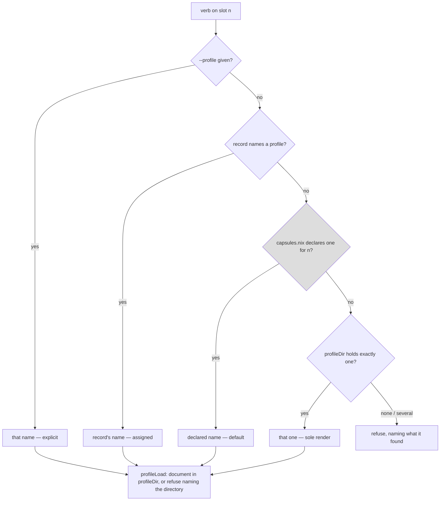
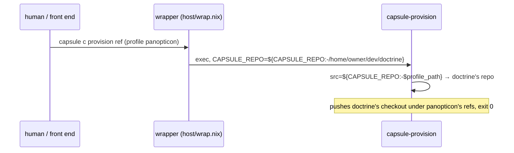

<!-- doctrine:section sec-1 -->
## What changes, and where the boundary sits

**Today**, the `capsule` front end answers *which target is this verb about?* in
three steps (`profileNameFor`, `host/cli.nix`): an explicit `--profile`, then the
slot's assignment record, then — for a slot nothing has assigned — the one
profile document this host has rendered, refusing when there are several. This
host has had two since `IMP-004` (`doctrine.json`, rendered by the module, and
`panopticon.json`, hand-written), so every unassigned slot refuses every
`profileVerb`, and `capsule all status` shows `-` for it.

Separately, on the module path, the wrapper every installed program runs through
(`host/wrap.nix`) supplies `CAPSULE_REPO` from the module's `repo` option — one
target's checkout. Both programs that look up a slot's source repo read
`${CAPSULE_REPO:-$profile_path}`, so the document's `path` is never reached:
a provision or a fetch for any profile uses doctrine's repo (`ISS-008`).

**After this slice:**

1. `capsules.nix` gains a per-slot `profile` — the host operator's declared
   choice of target for a slot nobody has assigned. All ten slots declare
   `doctrine` (`DEC-016`), the only image this host builds.
2. `profileNameFor` gains a step between the record and the sole-document
   fallback: the slot's declared `profile`.
3. The status table's profile cell brackets any answer that is not a record —
   `[doctrine]` — so a default never reads as an assignment (`DEC-014`).
4. The wrapper stops supplying `CAPSULE_REPO` and the `repo` option is removed
   (`DEC-013`): the profile document's `path` is the one home of a target's
   source on this host, and `CAPSULE_REPO` stays what a caller sets on purpose.
5. `POL-002` is revised so a profile *name* in a host declaration is a value,
   not a target learned by generic code (`DEC-012`).

The two halves land together because each makes the other honest: a slot that
defaults to a target whose repo the module path cannot reach is a provision that
pushes the wrong checkout and exits 0.

**Where the boundary sits.** Resolution stays the front end's act (`POL-003`,
`NOTES item 20`): no program reads `capsules.nix` or picks a target. The
declared value is rendered into the front end at build, the same way
`slotPolicy` renders the policy default. The document stays run-time host state
(`NOTES item 52`) and the only thing that can validate a name against it.

This diagram shows the resolution order after the change and which source each
answer comes from; the grey node is the new step.



Every answer ends in `profileLoad`, which is why a declared name no document
backs needs no check of its own (`DEC-015`, sec-3).

<!-- doctrine:section sec-2 -->
## The declaration: `profile` in `capsules.nix`

**Shape.** One optional field per slot, beside `policy`:

```nix
declared = {
  a = {
    index = 0;
    policy = "build";
    policies = policies.everything;
    profile = "doctrine";
  };
  # … b–j likewise, all "doctrine" (DEC-016)
};

recordOf = name: {
  index,
  policy ? null,
  policies ? [],
  profile ? null,
}: {
  inherit name index policy policies profile;
  # … unchanged
};
```

Optional in `recordOf` for the reason `policy` is: `guardCases`' fixture and
`policyCases`' fixture construct instances that are not slots, and a slot with no
declared profile is a legitimate state — it falls through to the sole-render
step. There is **no eval-time assertion** and there cannot be one:
`undeclared` checks `policy` against `policies.nix`, but a profile's only
authority is a file in `profileDir`, which is run-time state outside the store
and, for any document not rendered by the module, has no copy in this repo.

**The warrant, stated in the file.** The comment above `declared` currently
carries *"absence is not a state a perimeter may be in"* for `policy`. That
sentence does not transfer: an unassigned slot with no target is a perfectly
fine state. `profile`'s comment says instead that it is a **convenience** — the
operator saying which client a slot serves when nobody has said otherwise — and
that there is **no `profiles` set**, because
`docs/contract-assignment.md` § *Who may assign* makes an assigner unconstrained
in `profile` by design. It also says the value is not validated here and where
it is (`profileLoad`, at use).

**Why not `plan-d` §0's objection.** §0 forbids reading meaning out of a slot's
*name*. A declared field is the opposite mechanism: the meaning is written where
it can be read, changed, and refused. Nothing infers `doctrine` from `a`.

**Governance.** `POL-002` says a target's name may appear only in `target.nix`
and `inputs.target.url`. `DEC-012` narrows that sentence by revision, in this
slice: the prohibition is on code, programs and printed text learning a target;
a profile name used as a *key* in a host declaration is a value, which is what
the policy's own review test (*code changed, or only a value?*) already passes.
The revision is drafted with `doctrine revision` and lands in the same commit as
`docs/contract-target.md`'s matching sentence.

**Rendering into the front end.** `host/cli.nix` gains `slotDeclaredProfile`,
built exactly like `slotPolicy` from `capsules.instances`:

```bash
slotDeclaredProfile() {
  case "$1" in
    a) echo doctrine ;;
    # …
    none) echo - ;;   # a fixture slot declaring nothing
  esac
}
```

A rendered `case`, not a document read at run time: the declaration is host
config and changes by rebuild, which is what `capsules.nix` is for (`POL-003`,
one home). `-` is the absent value, as `recordField` uses it. The rendered name
is not escaped beyond what `slotPolicy` does today, because it is subject to the
same constraint; if a profile name can hold a character that needs it, both
change together (noted, not in scope).

<!-- doctrine:section sec-3 -->
## Resolution and the status cell

### `profileNameFor`'s fourth step

Inserted after the record, before the sole-render fallback:

```bash
profileName=$(recordField "$n" profile)
[ "$profileName" != - ] && return 0

profileName=$(slotDeclaredProfile "$n")
[ "$profileName" != - ] && return 0

mapfile -t rendered < <(profileNames)
# … unchanged
```

The function's header comment grows from three sources to four, in the order
authority runs, and says the declared step is the host operator's convenience
and not the front end's latitude — the sole-render step stays the only thing
this front end chooses on its own.

**No existence check here** (`DEC-015`). A declared name that no document backs
resolves, and every caller then reaches `profileLoad`, which refuses with
`no profile named '<name>' in <dir>`. Objective 3 asks exactly that. A check in
the resolver was rejected because `profileCell` maps any resolver failure to `-`,
so a misdeclared slot would read as *nothing* in status rather than as the name
nobody can load.

`profileLoad`'s second hint line — *"A profile is <name>.json there, rendered
from target.nix"* — has been false since a document could be hand-written. It
becomes *"rendered from target.nix by the module, or placed there by hand
(docs/contract-target.md)"*.

**Provision and the pin.** Unchanged, and it needs nothing: the dispatch at
`host/cli.nix:535` resolves a provision's profile once and forwards it as an
explicit `--profile`, so `provisionSlot`'s own `profileNameFor` takes the flag
step; `recordProvisioned` then writes the record and the pin, after which the
record step answers first. A declared default is consulted at most once per
provision.

**Errexit.** `profileCell` captures `profileNameFor` behind `||`, so errexit is
off inside it. The new step is two assignments and a test with no pipeline, and
`slotDeclaredProfile` is a `case` that cannot fail; nothing new can fail
silently. (`mem.fact.oubliette.errexit-skips-a-captured-function`.)

### The status cell (`DEC-014`)

| cell | when |
|---|---|
| `-` | nothing resolves (no record, no declaration, and zero or several documents) |
| `[name]` | resolved **without a record**: declared default or sole render |
| `name` | the record names it; pinned bytes agree with the host and the record |
| `name*` | recorded and pinned, and this host's document has moved on |
| `name!` | recorded and pinned, and the pin's bytes are not the ones the record names |

`profileCell` decides brackets by asking the one question that matters —
`recordField "$n" profile` is `-` — rather than by carrying a source variable
out of the resolver (the plumbing `DEC-015` rejected). Brackets never carry `*`
or `!`: only a provision writes a pin, and a provision writes the record.

```bash
profileCell() {
  local n="$1" pin host
  useHostProfiles
  profileNameFor "$n" 2>/dev/null || { echo -; return 0; }
  if [ "$(recordField "$n" profile)" = - ]; then
    echo "[$profileName]"
    return 0
  fi
  # … pin / * / ! logic unchanged
}
```

The column's width and header do not change; `POL-002`'s *"one table over N
slots and M targets"* holds, since brackets are a function of the record and
not of any target.

<!-- doctrine:section sec-4 -->
## Source: the document's `path`, and nothing in front of it

### Current behaviour



The same shape governs `capsule <slot> fetch`: the front end itself is wrapped
(`(wrap "capsule" cli)`, `host/services.nix`) and `repoFor` reads
`${CAPSULE_REPO:-$profile_path}`, so a fetch lands in doctrine's repo whatever
the slot runs.

### Target behaviour (`DEC-013`)

`host/wrap.nix`'s `defaults` loses `CAPSULE_REPO`:

```nix
defaults = {
  CAPSULE_STATE = paths.stateDir;
  CAPSULE_POLICY_DIR = paths.policyDir;
  CAPSULE_ALLOWLIST_DIR = paths.allowlistDir;
  CAPSULE_PROFILE_DIR = paths.profileDir;
};
```

Nothing in the two readers changes: `src="${CAPSULE_REPO:-$profile_path}"` and
`repo=${CAPSULE_REPO:-$profile_path}` were already right, and with nothing in
front of them the document answers. A caller who exports `CAPSULE_REPO` still
wins, which `host/git-channel-cases.nix:150` pins and keeps pinning.

The file's header — *"All five, and no exception table"* — becomes four, and
says why this is not the exception table it rejected: the other four have
**baked fallbacks** a program on `$PATH` would get wrong (`$PWD`-relative state,
the store's documents), whereas `CAPSULE_REPO`'s fallback is a value read from
the document the front end just resolved. A default in front of it is not a
default; it is a second answer.

`host/services.nix`: the `repo` option is deleted and `paths` stops passing it.
In its place, `imports = [(lib.mkRemovedOptionModule ["services" "capsule-perimeter" "repo"] "…")]`
with a message naming the replacement: *a target's source is its profile
document's `path`; set `path` in `target.nix`, or `CAPSULE_REPO` for a one-off*.
A host that set the option gets an eval error that says what to do rather than a
silent change of which repo it pushes. `~/flakes` sets no `repo`; its comment
naming it is the user's to edit (outside this repo).

**The cost, stated.** `cfg.repo` defaulted under the *owner's* home, so the
module stayed right on a host whose human is not `david`. That property is
lost: the module's own render takes `path` from `target.nix`, which is a
literal. It was only ever right for one target, and `docs/contract-assignment.md`
already names source as *host declaration, keyed by profile* — which the document
in `profileDir` is. A host whose checkout lives elsewhere edits `target.nix`'s
`path` or places its own document.

`capsule-brief --from-host` also reads a checkout (`docs/contract-target.md`'s
`path` row); it reads `$profile_path` directly and never consulted
`CAPSULE_REPO`, so it is unaffected — and was never subject to `ISS-008`.

<!-- doctrine:section sec-5 -->
## Code impact and verification

### Code impact

| path | change |
|---|---|
| `capsules.nix` | `profile ? null` in `recordOf`; `profile = "doctrine"` on all ten slots; the comment carrying its warrant (sec-2) |
| `host/cli.nix` | `slotDeclaredProfile` rendered beside `slotPolicy`; `profileNameFor`'s fourth step and header; `profileCell` brackets (sec-3) |
| `host/profile.nix` | `profileLoad`'s hint text (sec-3) |
| `host/wrap.nix` | `CAPSULE_REPO` leaves `defaults`; header rewritten for four (sec-4) |
| `host/services.nix` | `repo` option removed via `mkRemovedOptionModule`; `paths` loses `repo` (sec-4) |
| `host/policy-cases.nix` | fixture slot declares a profile; resolution, status and fetch cases (below) |
| `host/profile-cases.nix` | the hint's new wording, if a case asserts it |
| `host/wrap-cases.nix` | fixture loses `repo`; the set case becomes four; the composition case (below) |
| `flake.nix` | `wrapCases` is handed `hostPrograms.provision` |
| `POL-002` | revision (`DEC-012`) |
| `docs/contract-target.md` | `path` row (line 76) and `CAPSULE_REPO` row (352) lose the module's `repo` option; the `POL-002` sentence |
| `docs/contract-assignment.md` | ownership table's `profile` row gains *host-declared default per slot, `capsules.nix`* without gaining a set; the `source` bullet's *two host-side overrides* becomes one |
| `docs/plan-d-fleet.md` | L1's *"the cheap insurance was not taken"* — taken, as `profile`; line 380's override list |
| `README.md` | lines 276 and 513–515 describe the wrapper supplying `CAPSULE_REPO` |

### Verification

The kinds are not interchangeable (`CLAUDE.md`), and each objective goes to the
kind that can see it.

**Third kind — `policyCases`** (the front end's own text over a fixture pool).
The fixture's `none` slot stays undeclared; `one` gains `profile = "solo"`, and a
new `decl` slot declares a profile no document backs.

- *an unassigned slot with a declared profile resolves to it on a two-target host*
  — `writeProfile duo` already makes two; `one collect` passes `--profile solo`.
- *the record beats the declaration* — `assign one duo`, then `--profile duo`.
- *`--profile` beats both.*
- *an undeclared unassigned slot still refuses naming both* — the existing case,
  on `none`, stays green.
- *a declared profile no document backs refuses at use, naming the directory* —
  `decl collect` exits 1 and says `no profile named` and the profiles directory.
- *status brackets a declared default* — `^one .+ \[solo\]`.
- *status brackets the sole render* — with one document, an unassigned
  undeclared slot reads `[solo]`; the existing assertions that expect a bare
  name for unassigned slots are updated, not deleted.
- *status leaves a record bare, and `*`/`!` still mark it* — existing cases.
- *a misdeclared slot reads `[name]`, not `-`* — `decl`'s row.
- *a fetch with nothing set lands in the document's path* — the existing fetch
  block exports `CAPSULE_REPO`; one new round without it, against a fixture
  document whose `path` is the sandbox repo.

**Fourth kind — `wrapCases`** (the composition). Two changes:

- the *exactly these and no others* case becomes four names — a deliberate edit,
  as its comment requires;
- **new**: *with nothing set, the program's own fallback is reached*. The
  shipped `capsule-provision`, wrapped by the shipped builder over the `plain`
  fixture, run under `env -i` with `CAPSULE_PROFILE_DIR` pointed at a sandbox
  directory holding one document whose `path` is `/fixture/doc-repo`, refuses
  naming `/fixture/doc-repo`. It refuses before any transport, as
  `gitChannelCases` already relies on. Watched red against today's `wrap.nix`,
  where it names `/fixture/repo`.

**Unchanged and must stay green**: `gitChannelCases`' *CAPSULE_REPO still beats
the document* (line 150); `hostModuleUnits`, which now also proves the removed
option evaluates.

**Mutations to run** (`mem.pattern.oubliette.a-mutation-must-reach-the-case`):
drop the fourth step (the declared-resolution cases go red, the undeclared
refusal stays green); put `CAPSULE_REPO` back in `defaults` (the composition case
and the set case go red); drop the bracket (the status cases go red).

**Not exercised here, and said so.** No live provision on a second target —
`IMP-006` and `CHR-011` own that. The module-path fetch is pinned through the
front end's text and the wrapper's composition separately; the live host is
exercised only by `capsule all status` after the switch, which the user runs.

