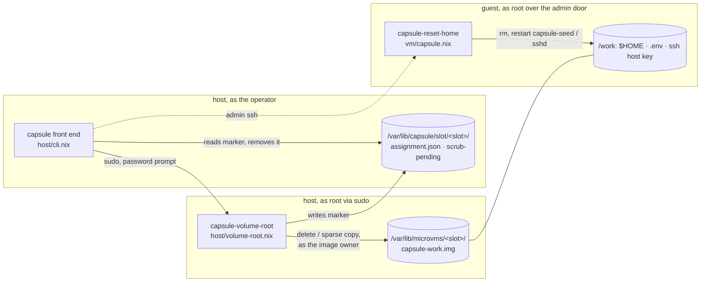
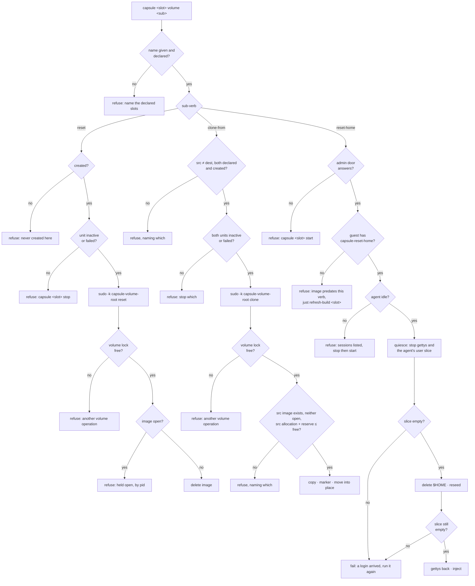

<!-- doctrine:section sec-1 -->
## What changes, and where the boundary sits

**Today** a slot's volume, the ext4 image at
`/var/lib/microvms/<slot>/capsule-work.img` that holds the checkout, `$HOME`, the
caches, `/work/baseline` and the guest's ssh host key, has no commands. Starting
clean (Plan D's S4) is a hand-typed `sudo rm` of that file. Resetting only the
agent's own state (S7) and starting warm from another slot (S5) are not possible
at all.

**After this slice** the front end has three volume commands and status shows
what each volume costs:

| command | slot must be | what it does |
| --- | --- | --- |
| `capsule <slot> volume reset` | stopped | deletes the image; the next `start` makes a cold one |
| `capsule <slot> volume reset-home` | running, nobody working in it | deletes `$HOME` in the guest, then re-injects credentials |
| `capsule <dest> volume clone-from <src> [--identity]` | both stopped | copies `src`'s image onto `dest`; unless `--identity`, the next injection scrubs the source's identity first |
| `capsule all status` | any | gains an allocation column and a free-space line |

The slot name is always explicit. `volume` never resolves to "the slot that is
up", and `all volume` is refused (`DEC-008`).

**Four parts, and what each is allowed to touch.** This diagram shows which
component runs as whom and where it acts. The dotted edge is the only place a
host decision reaches inside a volume, and it goes through a program the guest
already owns.



- **The front end** (`host/cli.nix`) parses the command, requires the name,
  checks the cheap preconditions, and composes the steps. It never deletes
  anything itself.
- **The root helper** (`capsule-volume-root`, new) is the only code that runs as
  root. It is the only code that touches an image file, and it does so only as
  the image's owner (sec-3). It also writes the clone's scrub marker. Its two
  state roots, `/var/lib/microvms` and `/var/lib/capsule`, are fixed when it is built, so a caller cannot point it anywhere else
  (`DEC-005`).
- **The guest program** (`capsule-reset-home`, new, in the image) is the only
  code that deletes inside a volume. It runs in the guest's own kernel against
  the guest's own filesystem, so the host never parses guest-written bytes
  (`DEC-001`). The paths it deletes come from declarations it already has
  (`DEC-002`, `DEC-003`).
- **The assignment record is not touched** by any of this (`DEC-006`). The marker
  sits in the record's directory but is a separate file with one writer (the
  helper) and one reader (the front end's injection step).

**What does not change:** `setup` is still the only command that assigns a slot.
The perimeter (`POL-001`) gains no guest-side control; `capsule-reset-home` is a
convenience the host invokes, not a security boundary. And volume commands apply
to **module-path slots** only: the devshell capsule's volume is `.vm/capsule/`,
and a slot is a module-path concept.

<!-- doctrine:section sec-2 -->
## Two preconditions, and the order every refusal is checked in

The volume noun carries two opposite preconditions (`DEC-001`, `DEC-004`), and
each refusal names the state it needs and the command that gets there.

**Stopped**, for `reset` and both slots of `clone-from`, means *no process holds
the image open*. It is checked twice, on purpose:

1. The front end refuses unless `microvm@<slot>` is `inactive` or `failed`
   (`unitState`, no root). This is the cheap early message, and it is only a
   stand-in: a unit can read `inactive` while a hand-run runner or a probe holds
   the image.
2. The root helper runs `fuser` on the image **in the same root process,
   immediately before** it deletes or copies. This is the real guarantee. It
   names the file rather than a process, which is the rule
   `mem.fact.oubliette.dead-guest-is-not-a-dead-vm` states for process names.

**Running and idle**, for `reset-home` and the clone's scrub, means *the admin
door answers and `agent` has no logind session except the gettys' autologins
and its own user manager*.

With nobody connected, a running guest already has three `agent` sessions. This
is what `loginctl show-session` reported on slot `b`, beside the admin door's own
login:

| session | TTY | `Service` | `Class` |
| --- | --- | --- | --- |
| `agent` autologin | `tty1` | `login` | `user` |
| `agent` autologin | `ttyS0` | `login` | `user` |
| `agent`'s user manager | - | `systemd-user` | `manager` |
| root over the admin door | - | `sshd` | `user` |

- `services.getty.autologinUser` logs `agent` in on **every** getty, not only the
  serial console. So "any `agent` process", and any test that names one console,
  always refuses.
- The `systemd --user` manager is a logind session of its own, present whenever
  any `agent` session is. A test that excludes only the autologins still lists
  it on every guest.
- **The rule:** an `agent` session is *working* unless its `Service` is `login`
  or its `Class` is `manager` or `manager-early`. Everything else refuses,
  including a class nobody has seen on this guest, so an unexpected session errs
  towards a refusal. What the user manager runs is not inspected here: the
  quiesce stops it (sec-4).
- An ssh login is a session with `Service=sshd` (the admin door's, above). A
  baseline is started detached (`setsid`) from one, and **assumed** to keep that
  session in `closing` until it exits, because NixOS leaves `KillUserProcesses`
  off (`ASM-001`). That assumption, and the values for an `agent` ssh login, are
  checked by a live exercise (see Verification).
- Idle is checked **before** the guest program quiesces the agent: it refuses on
  evidence that someone is working, then stops what that test cannot see (the
  gettys and the agent's user manager) before deleting anything. sec-4 has the
  sequence.
- The refusal names `capsule <slot> stop` then `start` as the way out. There is
  no `--force`: stopping is cheap and ends every session.

**One volume operation at a time on this host.** The root helper holds an
exclusive lock (`capsules.volumeLock`) for its whole run, and `capsule <slot>
start` takes the same lock shared around its `systemctl start` and stays-up
check. Either refuses rather than waits when the other holds it. This closes the
window between the helper's `fuser` and its act for every start the front end
makes; a `systemctl start` typed by hand does not take the lock, which is the
same boundary `capsule-inject` off `PATH` has (sec-5).

This flowchart gives the refusal order for each command. Every refusal exits
non-zero with a message naming its reason. Nothing is written before the last
check passes.



**Boundary conditions:**

- **`reset` on a slot whose image is already absent succeeds** and says so. A
  reset is a request for a missing image, and one is already missing.
- **`clone-from` onto a slot with no image** is allowed: the destination only
  needs to be created (its state directory exists).
- **The two copies of the front end refuse in different orders**
  (`mem.fact.oubliette.two-copies-refuse-in-different-orders`). The devshell copy
  has no relay socket, so `reset-home` refuses at the door there. That is
  expected, not a defect.
- **The helper re-validates everything the front end checked** except unit
  state: slot names against the pool it was built with, and `src ≠ dest`. It is a
  root program, and it must not trust an argument because a well-behaved caller
  checked it first.
- **An image that predates `capsule-reset-home` is not fixed by a restart.** A
  slot boots the guest closure `/var/lib/microvms/<slot>/current` points at.
  `capsule <slot> start` never moves that link; only `microvm -u` does, and
  `just refresh-build <slot>` runs it between a stop and a start
  (`justfile`, `refresh-build`), keeping the volume. So the refusal for a missing
  guest program names `just refresh-build <slot>`. Stop then start would boot the
  same image and meet the same refusal. The busy refusal keeps stop then start,
  because ending sessions is what a busy agent needs.
- **"A login arrived" is detected, not prevented.** Blocking agent logins for the
  duration needs `pam_nologin` in the guest's sshd PAM stack, which it does not
  have (`IMP-011`).

<!-- doctrine:section sec-3 -->
## The root helper: `capsule-volume-root`

**One program, the only one that runs as root, and the only one that touches an
image file** (`DEC-005`). New file `host/volume-root.nix`:

```nix
{
  pkgs, lib,
  capsules,                          # the pool: slot names, volumeLock, volumeReserve
  microvms ? "/var/lib/microvms",    # image root, fixed at build
  moduleState ? "/var/lib/capsule",  # record root, where the marker goes
  imageOwner ? {user = "microvm"; group = "kvm";},  # who acts inside the image directory
  tools ? ''                         # the three steps a sandbox cannot provoke
    freeBytes() { df --output=avail -B1 "$1" | tail -n 1; }
    asImageOwner() { setpriv --reuid=${imageOwner.user} --regid=${imageOwner.group} --init-groups -- "$@"; }
    commitImage() { asImageOwner mv -T -- "$1" "$2"; }
  '',
}: pkgs.writeShellApplication { name = "capsule-volume-root"; ... }
```

All host-specific values are **build-time arguments**, so every real call site
gets one store path and a suite builds its own against a sandbox. Two of them
come from `capsules.nix`, which gains two values (`POL-003`, one home each):

```nix
# capsules.nix, beside socketOf, which already owns /run/capsule
volumeLock = "/run/capsule/volume.lock";   # one volume operation at a time
volumeReserve = 20 * 1024 * 1024 * 1024;   # bytes a clone must leave free
```

A suite passes a fixture pool whose `volumeLock` is a shell expression under its
own directory, as `host/policy-cases.nix` does for `moduleState`. A tmpfiles rule
in `host/services.nix` makes the lock file (`0644 root`) at boot, so the front end
can open it for reading without creating anything under `/run`. **None of them may be a run-time argument**: this program runs as root,
and a later password-less grant (`IMP-010`) must not be pointable at `/`.
`tools` is a shell fragment of functions, the shape `host/cli.nix`'s
`guestControl` already takes, because `df`, `setpriv` and `mv` come from
`runtimeInputs` and a suite cannot shadow them on `PATH`: a sandbox can neither
mount a filesystem small enough to force the free-space refusal, nor drop to a
second uid, nor crash the program between two lines.

**Root does no path-based act inside an image directory** (`RV-003` `F-1`).
Read on this host on 2026-09-15: `/var/lib/microvms` is `microvm:kvm 0775`, each
`/var/lib/microvms/<slot>` is `root:kvm 0775`, and `microvm`, the uid every VMM
runs as whichever slot it serves, is in `kvm`. A root `cp`, `chown` or `chmod` by
path in there is a symlink race that any running VMM can win: root would change
the owner or mode of an arbitrary file, overwrite one, or copy one `microvm`
cannot read into an image it can. So every act that creates, modifies, renames
or removes a file in an image directory goes through `asImageOwner`, and
`imageOwner` is who it runs as. As that owner, a won race gains nothing: the
owner already owns every image, and a swapped source it cannot read fails the
copy. No `chown` is needed, because the owner creates the copy. Root keeps what
writes nothing through that directory: the lock, `fuser`, the fit check's `stat`,
and the marker, which sits in the operator's `0750` record directory where
`microvm` cannot write.

**Usage:** `capsule-volume-root reset <slot>` and
`capsule-volume-root clone <src> <dest> [--identity]`.

**Names used below:** `owner …` is `asImageOwner …`;
`img(s)` is `${microvms}/<s>/capsule-work.img`;
`created(s)` is `${microvms}/<s>/current/bin/tap-up` being executable, the same
test as `host/cli.nix`'s `created`; `marker(s)` is
`${moduleState}/slot/<s>/scrub-pending`.

**Both sub-commands start the same way:** `exec 9<>"${volumeLock}"` and
`flock -n 9`, refusing with "another volume operation is running" if the lock is
held. The lock is held until the process exits, so every check and act below is
inside it. It serialises helper runs against each other (the temporary file,
the capacity check, the marker) and against `capsule <slot> start`, which takes
it shared (sec-7). A crash releases it, because the kernel drops a `flock` with
its last file descriptor.

**Algorithm, `reset`:**

1. Refuse unless `<slot>` is in the pool it was built with.
2. If `img(slot)` is absent, say "already fresh", remove any `marker(slot)`, and
   exit 0.
3. `fuser` on `img(slot)`: if anything holds it, refuse and print the pids.
4. `owner rm -f -- img(slot)`, then remove `marker(slot)` (as root) if present. A fresh volume has
   no identity to scrub. A crash between the two leaves a marker over no image,
   whose only effect is a scrub of the cold volume the next start makes.

**Algorithm, `clone`:**

1. Refuse unless both names are in the pool and differ, `img(src)` exists,
   `created(dest)`, and `${moduleState}/slot/<dest>/` exists. **The helper never
   creates that directory**: it belongs to the operator (`0750`, the record
   writer's), and one made by root would refuse every later record write. The
   front end makes it, as the operator, before calling the helper (sec-7).
2. `fuser` on both images (the destination's only if present). Refuse if either
   is held.
3. Refuse unless the source's **allocated** bytes (`stat -c '%b * %B'`) plus
   `volumeReserve` are at most `freeBytes` of the destination directory.
   `freeBytes` is `df`'s `avail`, the space **non-root** writers have. The copy
   runs as root and could eat into ext4's root reserve, but the running VMMs run
   as `microvm` and grow their sparse images into `avail`, so a clone that left
   `avail` at zero would stop every running guest's writes (measured 2026-09-15:
   107 GiB `avail`, about 100 GiB more in the root reserve). The reserve is that
   headroom, declared. It bounds this clone only: growth of existing images is
   `RSK-007`.
4. `tmp=${microvms}/<dest>/capsule-work.img.clone`, a **fixed name in the
   destination directory**. Install `trap` on `EXIT` that runs
   `owner rm -f tmp`, which after a successful step 6 names nothing, so a copy
   that fails (`ENOSPC`, a read error) leaves nothing behind. Then
   `owner rm -f tmp` for a leftover from an earlier run killed mid-copy (the
   lock means no other helper is writing it, and step 2 showed the destination
   is not in use), `owner cp --sparse=always img(src) tmp` (the move below is
   then a same-filesystem rename), and `owner chmod 0644 tmp`, matching the
   runner's own images.
5. Unless `--identity`: if `marker(dest)` is absent, write it (content: the
   source slot name and a UTC timestamp, for a human reading it) and remember
   that **this run created it**. A marker already present belongs to an earlier
   clone that has not been scrubbed yet, and it is left exactly as it is.
6. `commitImage tmp img(dest)`. If that fails: remove `marker(dest)` **only if
   this run created it**, and exit non-zero (the trap removes `tmp`).
7. Under `--identity`, after a successful move: remove any `marker(dest)`. The
   destination now carries the source's identity on purpose, so an earlier
   clone's marker would scrub what the operator asked to keep.

**The marker invariant:** `marker(dest)` exists whenever `img(dest)` may carry
another slot's identity that nobody chose to keep. Each step is ordered so a
crash or failure errs towards a marker that is not needed, never towards a
missing one:

| interrupted | what is left | effect |
| --- | --- | --- |
| step 4 fails | old image, old marker state | trap removed `tmp`; nothing else changed |
| killed during step 4 | `tmp`, old image, old marker state | no trap runs; next clone removes `tmp` |
| between 5 and 6 | new marker over the destination's *own* image | next inject scrubs its own `$HOME`: data lost, no identity leaked |
| step 6 fails, marker pre-existed | earlier clone's image and its marker | still scrubbed, as before this run |
| between 6 and 7 (`--identity`) | an earlier clone's marker over the new image | a scrub the operator did not ask for: fail-safe |

A failed move that removed a marker it did not write would leave an earlier,
unscrubbed clone with no marker, and that is an identity leak. That is why
step 6 removes only what step 5 wrote.

**Exit statuses:** 0 done; 1 refused (reason on stderr); 2 usage. The front end
passes the message through unchanged.

**How it is invoked:** the front end runs
`sudo -k <store path>/bin/capsule-volume-root …`. **`-k` is load-bearing**: with a
command, it makes sudo ignore cached credentials, always prompt, and not refresh
the ticket (`man sudo`). Without it the prompt is usually absent, because the
`stop` a reset requires runs `sudo systemctl stop` moments earlier
(`host/cli.nix:1486`), and `DEC-010` counts that prompt as the second keystroke.
No sudoers rule is added. A future grant would follow `host/proxy-restart.nix`'s
one-spelling shape (`IMP-010`), and would have to reopen `DEC-010`.

<!-- doctrine:section sec-4 -->
## The guest program: `capsule-reset-home`

**The only code that deletes inside a volume** (`DEC-001`), shipped in the guest
image. New file `vm/reset-home.nix`, called from `vm/capsule.nix` and added to
`environment.systemPackages`:

```nix
{
  pkgs, lib,
  home,          # vm/capsule.nix's own binding: "${work}/home"
  agentUid,      # config.users.users.agent.uid, so the slice is user-<uid>.slice
  scrubPaths,    # absolute paths removed only under --scrub (below)
  tools ? ''     # the one thing tying it to a running guest
    agentSessions() { ... }     # one line per agent session: id, tty, service, class, state
    activeGettys() { systemctl list-units --state=active --no-legend --plain \
      'getty@*' 'serial-getty@*' | awk '{print $1}'; }
    startUnit() { systemctl start "$@"; }
    stopUnit() { systemctl stop "$@"; }
    restartUnit() { systemctl restart "$1"; }
    unitActive() { systemctl is-active --quiet "$1"; }
  '',
}: pkgs.writeShellApplication { name = "capsule-reset-home"; ... }
```

**Where `scrubPaths` comes from** (`DEC-003`), assembled in `vm/capsule.nix`:

```nix
scrubPaths =
  builtins.filter (p: !lib.hasPrefix "${home}/" p)
    (map (i: i.dest) (import ../setup.nix { volumePath = work; }))
  ++ lib.concatMap (k: [k.path "${k.path}.pub"]) config.services.openssh.hostKeys;
```

Destinations under `$HOME` are dropped from the list, because the `$HOME` delete
already covers them. Only the `dest` strings reach the program's text, so editing
a payload's `produce` command does not change the image. For today's
declarations the list is `/work/.env` plus the ed25519 host key and its `.pub`.

**Usage:** `capsule-reset-home [--scrub]`, run as root.

`slice` below is `user-${agentUid}.slice`: the cgroup systemd puts every one of
the agent's sessions and its user manager in. What was seen on slot `b` with a
running guest and nobody connected: sessions on `ttyS0` and `tty1` plus the
`systemd --user` manager, all in that slice.

1. **Refuse on evidence of work.** `workingSessions` filters `agentSessions` by
   sec-2's rule. If it prints anything, refuse with exit status **3** and list
   the sessions (id, TTY, service, class, state). The filter is the program's own
   text and only the listing is in `tools`, so a suite runs the rule against the
   sessions a real guest reports rather than stubbing the answer.
2. **Quiesce what that test cannot see.** Record `activeGettys`, `trap` on `EXIT`
   to `startUnit` them again, then `stopUnit` them. Stopping only the ttyS0 getty
   is not enough: on slot `b`, `getty@tty1` logged `agent` back in within five
   seconds.
3. `stopUnit "$slice"`. The stop returns once every unit in the slice has
   stopped: on slot `b` it took 51 ms and left no process owned by `agent`. This
   ends the autologin sessions, the user manager and anything it ran, which is
   the population a session list misses. Refuse with exit status **4** unless
   `! unitActive "$slice"`.
4. `rm -rf -- "${home}"` with **no trailing slash**. If the agent replaced
   `$HOME` with a symlink, only the link is removed. `rm -rf` never follows links
   inside the tree.
5. `restartUnit capsule-seed`. It is a `RemainAfterExit` oneshot, so a restart
   re-runs the seed, which recreates `$HOME` owned by `agent` and re-links the
   config files. It runs as root in its own unit, so it does not start the slice.
6. Under `--scrub`: `rm -f --` each of `scrubPaths`, then
   `startUnit sshd-keygen`, then `restartUnit sshd`. **`sshd` does not make host
   keys itself.** On the pinned nixpkgs a separate `sshd-keygen.service` does. It
   is a oneshot with no `RemainAfterExit`, so it is inactive again after the
   boot that ran it, and it runs only while a declared key is missing
   (`ConditionFileNotEmpty`). A restart of `sshd` would probably pull it in
   through `sshd`'s `wants`, but that is implicit, so the program starts it by
   name first. Restarting `sshd` leaves established sessions in place, including
   the admin session running this program: the unit has `KillMode=process`, so
   only the listener is replaced. That is **assumed** (`ASM-002`) and checked
   live.
7. **Detect a login that arrived during steps 3–6.** If `unitActive "$slice"`,
   exit **4**, "an agent login arrived during the reset; its `$HOME` may be
   partial, so run it again". Nothing prevents that login: blocking needs
   `pam_nologin` in the guest's sshd stack, which it lacks, and OpenSSH does not
   check `/etc/nologin` itself when PAM is on (`openssh session.c:1502`). That
   is `IMP-011`.

The `EXIT` trap then starts the recorded gettys, which log `agent` in again.
That also happens on every refusal after step 2.

**Exit statuses:** 0 done; 3 busy; 4 the agent could not be kept out; anything
else is a failure the front end reports as-is. The front end reads **127** (command not found) as "this slot's
image predates the verb".

**What it does not know:** what a credential is, what `.doctrine/` is, or which
target is confined (`POL-002`). It deletes a directory the guest module named and
paths two declarations named.

<!-- doctrine:section sec-5 -->
## The clone, and the gate that makes its scrub fail-safe

**A clone is two acts separated in time:** the copy, which needs both slots
stopped, and the scrub, which needs the destination running. The marker is what
connects them (`DEC-011`), and the gate that reads it sits at **the one place
every injection passes through**, the front end's `work()` just before it runs
`capsule-inject`.

This sequence shows a clone from `b` to `d` followed by an ordinary start. The
same gate fires for `capsule d setup …` and `capsule d inject`, because both
reach `work d inject`.

```mermaid
sequenceDiagram
  actor Op as operator
  participant FE as capsule front end
  participant RH as capsule-volume-root (root)
  participant G as guest d (admin door)
  participant INJ as capsule-inject

  Op->>FE: capsule d volume clone-from b
  FE->>FE: names explicit, declared, created; both units stopped
  FE->>FE: mkdir -p slot/d (as the operator)
  FE->>RH: sudo -k … clone b d
  RH->>RH: volume lock · fuser both · fits with reserve · cp sparse · chown
  RH->>RH: write slot/d/scrub-pending, unless one is already there
  RH->>RH: commitImage (mv into place)
  FE-->>Op: cost, "clean source not checked", next steps

  Op->>FE: capsule d start
  FE->>FE: shared volume lock · systemctl start · wait for door
  FE->>FE: work d inject → marker present?
  FE->>G: capsule-reset-home --scrub
  alt exit 0
    G-->>FE: quiesced · $HOME, .env, host key gone · seed, keygen, sshd restarted · gettys back
    FE->>FE: remove marker
    FE->>INJ: capsule-inject --capsule d
    INJ->>G: write credentials (nothing exists, so none skipped)
  else any other status
    G-->>FE: 3 busy · 4 a login arrived · 127 missing · 255 ssh failed · other
    FE->>FE: resetHomeRefusal d status
    FE-->>Op: reason and remedy · nothing injected · marker kept
  end
```

**The gate, as a front-end function** (`scrubPending`, called at the top of
`work()` when the verb is `inject`). It shares with the `reset-home` branch one
function that turns the guest program's status into a reason and a way out, so
the two paths cannot tell the operator different things about the same failure:

```bash
# The guest program's status, as a reason and a remedy. It prints and returns;
# each caller says what it did not do, and exits or returns on its own.
resetHomeRefusal() {
  local n="$1" rc="$2"
  case "$rc" in
    127) echo "capsule $n: this slot's image predates capsule-reset-home (status 127)."
         echo "  just refresh-build $n moves the slot onto the current image and keeps the volume." ;;
    3)   echo "capsule $n: the agent is busy (sessions above), so nothing was reset."
         echo "  capsule $n stop, then start, ends every session." ;;
    4)   echo "capsule $n: an agent login arrived during the reset, so \$HOME may be partial;"
         echo "  run it again." ;;
    255) echo "capsule $n: ssh to the admin door failed (status 255), so what the guest did is unknown;"
         echo "  run it again once capsule $n status shows the door." ;;
    *)   echo "capsule $n: capsule-reset-home exited $rc." ;;
  esac >&2
}

scrubPending() {
  local n="$1" m rc=0
  m="$(slotDir "$n")/scrub-pending"
  [ -e "$m" ] || return 0
  echo "capsule $n: this volume was cloned ($(cat "$m")) — scrubbing before inject"
  guestResetHome "$n" --scrub || rc=$?
  if [ "$rc" -ne 0 ]; then
    resetHomeRefusal "$n" "$rc"
    echo "capsule $n: nothing was injected; the marker stays." >&2
    return 1
  fi
  rm -f -- "$m"
}
```

- **255 is read as ssh's, not the program's.** ssh exits 255 when its own
  connection fails, and `capsule-reset-home` defines only 3 and 4, beside a usage
  error's 2 and whatever status a failing step returns. So 255 means the admin
  connection failed, before the program ran or during it (sec-4's `sshd` restart
  is the moment `ASM-002` bets on). The outcome is unknown either way, and both
  paths are safe to run again: the marker stays, and a reset repeated from any
  point deletes and reseeds the same things.
- **The gate is where 127 is most likely.** `clone-from` needs both slots
  created, not refreshed, so a clone onto a slot whose image predates this slice
  meets 127 at its first `start`. `just refresh-build` restarts a running slot
  through `capsule start`, so the scrub runs again from there by itself.
- `guestResetHome` is a new function in the existing `guestControl` argument, so a
  suite substitutes it exactly as it substitutes `guestHead` today.
  `resetHomeRefusal` is **not** in that argument: it is in the front end's main
  body, because a suite substitutes the guest's status and asserts what the front
  end makes of it.

**Why the inject still connects after the scrub:** the scrub gives the guest a new
ssh host key at the same address. The admin door does not check host keys
(`StrictHostKeyChecking=no`, `UserKnownHostsFile=/dev/null`,
`host/guest-ssh.nix:48-50`), so `capsule-inject` connects straight after. The
human's own door does check them, which is why the clone's output names
`just reset-known-hosts`.

**Choices this section makes:**

- **`clone-from` does not start the destination.** It prints the next commands
  (`capsule d start`, then `setup`) and leaves lifecycle to the lifecycle verbs.
  One act per command keeps the failure modes separate.
- **`--identity` writes no marker**, so `inject` skips as it always has, and the
  source's credentials are kept on purpose.
- **The success output says the clean-source rule was not checked** (`DEC-007`)
  and gives the manual recipe until `IMP-008` lands. It also prints the source's
  allocated size and `just reset-known-hosts d`, because the human's own ssh door
  checks host keys strictly and the clone has the source's key until the scrub
  runs.

**Known boundary, stated rather than closed:** running `capsule-inject --capsule d`
straight off `PATH` does not pass through `work()`, so it does not see the
marker. The programs do not know where the record lives, by design
(`mem.fact.oubliette.capsule-state-moves-the-quarantine-not-the-record`).
`capsule` is the human's route, and the module wraps nothing that injects without
it.

**`reset-home` uses the same pieces without a marker:** the front end checks the
door answers and calls `guestResetHome "$n"`. On 0 it runs `work "$n" inject`;
on anything else it calls `resetHomeRefusal "$n" "$rc"` and exits 1, never the
guest's status, since a front end exiting 127 reads as a missing `capsule`. That
call also passes the gate, so a clone that was never scrubbed gets scrubbed here
too. On a marked slot that means `$HOME` is deleted twice, once by `reset-home`
and once by the scrub. The second deletion removes only what the seed just made,
so it is left as is rather than given a branch of its own.

<!-- doctrine:section sec-6 -->
## Status: what a volume costs

`capsule all status` gains an **`alloc`** column immediately after `disk`, and
one line under the table (`DEC-009`).

- **`alloc`**: the image's allocated size, human-readable (for example `3.3G`),
  or `-` if there is no image. It is read host-side with
  `stat -c '%b %B' <image>`, which needs neither root nor the guest: the image is
  `0644` in a `0775` directory. So it is **filled for stopped slots**, unlike
  every guest-observed column. It is the source's high-water mark, which is
  exactly what a clone of that slot would cost.
- **`disk`** keeps its meaning: the guest's `df /work` use percentage, `-` when
  not running. The two headers sit side by side, and `IMP-009` owns the wider
  question of how legible the table is.
- **The free line**, printed after the table and before `perimeter:`:

  ```
  volumes: 107G free on /var/lib/microvms, 20G of it kept back from clones (2 images outside the pool: capsule, capsule-b)
  ```

  "Free" is `df`'s `avail`, the same number the clone's fit check reads, and the
  reserve is `capsules.volumeReserve`, so a reader can predict a clone's refusal
  from this line and the source's `alloc`. The parenthesis appears only when the
  image root holds state directories that are not declared slots. It is how `CHR-013`'s leftovers become visible without
  anyone listing the directory.

**Why the front end's `microvms` becomes an argument:** `host/cli.nix:220`
currently binds `microvms = "/var/lib/microvms"` in a `let`. It becomes an
argument with that default, as `moduleState` already is, so a suite can read
`alloc` and the free line against a fixture root (`POL-004`). Every real call
site takes the default, so both copies of the front end stay one store path.

**No new column that comes and goes:** `alloc` is always printed, and the free
line is always printed (`host/cli.nix:916`'s rule). Only the parenthesis inside
the free line varies, and it describes the host, not a target.

<!-- doctrine:section sec-7 -->
## Front-end surface and seams

**The verb.** `"volume"` joins `ownVerbs` (`host/cli.nix:196`). Its branch
parses one sub-verb:

```
capsule <slot> volume reset
capsule <slot> volume reset-home
capsule <dest> volume clone-from <src> [--identity]
```

`usage()` gains one line under the lifecycle group:

```
  volume:    <slot> volume reset | reset-home | clone-from <src> [--identity]   (name required)
```

**"Name required" means the name came from argv.** The branch refuses when the
name was resolved to the slot that is up, **and also when it came from
`CAPSULE_NAME`**. That variable is ambient to a shell working in a capsule, which
is exactly where someone types a destructive command meaning a different slot.
The front end records `nameFrom=argv|env|resolved` where it already decides the
name (`host/cli.nix:280-303`), and the branch checks it. `all volume` is refused
with the aggregation message the other actions already use.

**Seams, all arguments with defaults, so every real call site is one store path:**

| argument | default | substituted by a suite for |
| --- | --- | --- |
| `microvms` (new) | `"/var/lib/microvms"` | `alloc`, the free line, `created` |
| `volumeControl` (new) | `volumeRoot() { sudo -k ${volumeRootHelper}/bin/capsule-volume-root "$@"; }` | the root step, without root |
| `guestControl` (existing) | gains `guestResetHome() { … admin ssh … capsule-reset-home "$@"; }` | the guest program's exit status |

The start lock needs no new argument: it is `capsules.volumeLock`, and a suite's
fixture pool already substitutes `capsules`.

`volumeRootHelper` is `host/volume-root.nix` applied to the same `capsules`, and
it is threaded in from `host/programs.nix`, beside the other programs the front
end refers to by store path. `observe` is the precedent.

**Inside the branch, in order:** check where the name came from; check the
sub-verb; run the checks from sec-2 that need no root (`created`, `unitState`,
the door); then exactly one of `volumeRoot reset …`, `mkdir -p "$(slotDir
"$dest")"` followed by `volumeRoot clone …`, or `guestResetHome` followed by
`work "$name" inject` or `resetHomeRefusal` (sec-5). The `mkdir` is the front
end's because the record directory is the operator's, and the helper refuses
rather than make it as root (sec-3). `scrubPending` goes at the top of `work()`
for `inject`, as sec-5 shows.

**A reset names what a fresh volume breaks.** The guest's ssh host key lives on
the volume, so after a reset the next start has a new key at the same address,
and the operator's own door checks host keys strictly
(`mem.fact.oubliette.fresh-capsule-fresh-host-keys`). So once `volumeRoot reset`
succeeds, the branch prints `next: just reset-known-hosts <slot>; capsule <slot>
start`, as `clone-from` prints its next steps. When the root step refuses, it
prints nothing more.

**`start` takes the volume lock.** Around its existing `sudo systemctl start` and
two-second stays-up check, the `start` branch opens `capsules.volumeLock` for
reading and runs `flock -s -n` on it, refusing with "a volume operation is running
on this host; try again when it finishes" if the helper holds it. Shared, so two
starts do not exclude each other. The lock is host-wide, so a clone of `a` onto
`b` also makes `capsule c start` refuse while it runs; a clone of an image of a
few GiB takes seconds, and per-slot locks would add ordering rules to buy that
back. Released before the inject, which needs no lock: the helper never touches a
running slot's image.

**Module path:** `host/services.nix` installs the front end already, and its
wrapper supplies defaults without hard-exporting them
(`mem.fact.oubliette.wrap-hard-exports-defeat-the-caller`). This slice adds no
environment variable, so `wrapCases` needs no change. It gains one tmpfiles rule,
`f ${capsules.volumeLock} 0644 root root -`, so the lock exists before any start
and the front end never has to create a file under `/run`. If the file is absent,
the host's module predates this slice and no helper built with it can be running
through the front end, so `start` proceeds without the lock and says so on
stderr, rather than refusing every start on a host that has not rebuilt. `capsule-volume-root` is
not put on `PATH`: it is reached only through the front end's store path.

<!-- doctrine:section sec-8 -->
## Code impact and verification

**Code impact:**

| path | change |
| --- | --- |
| `host/volume-root.nix` | **new**: the root helper (sec-3) |
| `host/volume-root-cases.nix` | **new**: its suite, built against a sandbox root with `tools` substituted, the drop to the image owner included |
| `vm/reset-home.nix` | **new**: the guest program (sec-4) |
| `vm/reset-home-cases.nix` | **new**: its suite, with a fixture `home`, fixture `scrubPaths`, and `tools` stubbed |
| `vm/capsule.nix` | builds `scrubPaths` from `setup.nix` and `openssh.hostKeys`, passes `agentUid`; adds the program to `systemPackages` |
| `capsules.nix` | **two values**: `volumeLock` and `volumeReserve` (sec-3) |
| `host/services.nix` | one tmpfiles rule for `volumeLock` |
| `host/cli.nix` | `volume` verb; `nameFrom`; `microvms`, `volumeControl` (`sudo -k`), `guestResetHome`; `resetHomeRefusal`, called by `scrubPending` in `work()` and by the `reset-home` branch; `reset`'s next-step line; shared volume lock in `start`; `alloc` column and free line with the reserve |
| `host/volume-cases.nix` | **new**: the front end's volume branch against a fixture pool, rendered the way `host/policy-cases.nix` renders its own |
| `host/programs.nix` | builds `volumeRootHelper` and threads it to the front end |
| `flake.nix` | the three suites as outputs, each a short `import` |
| `justfile` | the three suites in **both** `build` and `cases` (`NOTES item 51` step 3) |
| `docs/contract-assignment.md` | line 277: clean-source rule stated as not enforced, owned by `IMP-001` |
| `docs/probes.md` | disk row re-measured |
| `CLAUDE.md` | the suite list in *Working here* names the three new suites |

**Suites and their key cases.** Each refusal is asserted by its **reason** as
well as its status. Each suite is checked by mutating the behaviour it pins and
watching the named case go red.

`volumeRootCases`:
- reset refuses an undeclared name, such as `capsule`
- reset refuses an image held open (a background `exec 3<` on the fixture image) and prints the pid
- reset and clone both refuse, by reason, while another process holds `volumeLock` (the suite holds it with `flock` in the background), and act once it is released
- reset of an absent image succeeds, says "already fresh", and removes a stale marker
- clone refuses `src = dest`, a missing source image, a destination that was never created, and a destination with no record directory, and **creates no record directory** when it refuses
- clone refuses when the source's allocation plus the fixture's `volumeReserve` exceeds `freeBytes` by one byte, and proceeds when they are equal
- clone whose copy cannot read its source (an unreadable fixture source) exits non-zero and writes no marker; `cp` refuses before creating anything, so this case cannot see the trap
- clone produces a sparse destination with mode `0644`, and removes a leftover `capsule-work.img.clone` before copying
- **every act inside an image directory goes through `asImageOwner`** (the stub logs what it runs): a clone's `rm`, `cp`, `chmod` and `mv`, the trap's `rm`, and reset's `rm`; the marker's write and removal do not
- a copy that fails after the temporary image exists (the stub refusing the `chmod`) leaves no `capsule-work.img.clone`
- **the shipped render** (this host's values) calls `setpriv --reuid=microvm --regid=kvm --init-groups`
- clone writes the marker unless `--identity`; **the marker exists when the image is committed** (`commitImage` stubbed to fail unless the marker is present, then move)
- clone whose commit fails removes the marker it wrote and the temporary file
- **clone whose commit fails keeps a marker it did not write** (a pre-existing marker, `commitImage` stubbed to fail): the earlier clone stays marked
- clone with `--identity` over a pre-existing marker removes it after the commit, and keeps it when the commit fails
- **mutation:** move the marker write after `commitImage`; the "marker exists when the image is committed" case goes red. Make step 6 remove the marker unconditionally; the "keeps a marker it did not write" case goes red. Run the `cp` as root rather than through `asImageOwner`; the drop case goes red

`resetHomeCases`:
- with `agentSessions` stubbed to print sec-2's table (the two autologins and the user manager), nothing refuses; adding an `sshd` session, or a session of any other class such as `background`, refuses with status 3 and lists it; a refusal stops nothing
- **mutation:** drop the `manager` exclusion from the filter; the three-session case goes red
- in order: stop the recorded gettys, stop the agent's slice, remove `$HOME`, restart `capsule-seed`, then start the recorded gettys again
- exits 4 when the slice is still active after its stop, and when it becomes active during the reset (`unitActive` stubbed per call); the gettys are started again on both, and on any other failure after they were stopped
- a `$HOME` that is a symlink: the link goes, and its target survives
- `--scrub` removes exactly `scrubPaths`, then starts `sshd-keygen`, then restarts `sshd`, in that order; without `--scrub`, none of those happens
- **eval-level:** `scrubPaths` for this host contains no path under `$HOME`, and contains `/work/.env` and the host key

`volumeCases`:
- every sub-verb refuses a resolved name and a `CAPSULE_NAME` name, and accepts an argv name
- `all volume` refused; unknown sub-verb refused
- `reset` refuses a running unit before calling `volumeRoot` (the stub's log stays empty)
- `reset` that succeeds prints `just reset-known-hosts dst`; one whose root step refuses does not
- `reset-home` refuses by reason **and remedy** for each guest status, and exits 1 for each: 127 names `just refresh-build dst` and not `stop, then start`; 3 names busy and `capsule dst stop`; 4 names a login arrived and run it again; 255 names ssh and the door; any other status is named
- `start` refuses, by reason and before `systemctl`, while the fixture `volumeLock` is held exclusively; two starts do not exclude each other; an absent lock file starts with a warning
- **eval-level:** the shipped `volumeControl` default invokes the helper with `sudo -k`
- `inject` with a marker: scrub called first, then marker removed, then inject
- `inject` with a marker and a scrub that fails with 127, 3, 4, 255 or another status: inject is not called, the marker stays, and the refusal carries the same reason and remedy as `reset-home`'s for that status
- **mutation:** drop the `resetHomeRefusal` call from `scrubPending`; the gate's per-status cases go red and `reset-home`'s stay green. Put stop then start back as 127's remedy; both 127 cases go red
- `clone-from` makes the destination's record directory before calling `volumeRoot`, and makes nothing when an earlier check refuses
- `alloc` and the free line against a fixture root, including the "outside the pool" parenthesis

**Live exercises, which no suite can reach** (`STD-001`: root, a real image, a real guest):

1. `volume reset` on a finished slot: the image is gone, `start` makes a cold volume, and the `fuser` refusal fires with the unit stopped but the image held.
2. `volume reset-home` on a running idle slot, then with an `agent` ssh session open (refused), then with a detached baseline running. Before each, read `loginctl show-session -p Service -p Class -p State` for every `agent` session, and compare with sec-2's table: the autologins and the user manager were read on slot `b`, but an `agent` ssh login and a detached baseline's session were not. After the idle run, both gettys are back and have logged `agent` in again. **This confirms or refutes `ASM-001`, sec-2's session assumption.**
3. `volume clone-from` a stopped slot, then `start`. Before the start, the destination image is `microvm:kvm` with no `chown` having run; and with the source image replaced by a symlink to a root-only file on a stopped slot, the clone fails at the copy and leaves no `capsule-work.img.clone`. Read back that the scrub ran before inject, that `.env` and the credential files on the clone are this host's, that the host key's fingerprint differs from the source's, and that `sshd` restarted without dropping the admin session. **This confirms or refutes `ASM-002`.**
4. `capsule all status` shows `alloc` for stopped slots and the free line.
5. With a `volume clone-from` running, `capsule <other> start` refuses naming the volume operation, and succeeds once the clone finishes. A second `volume reset` run at the same time refuses the same way.

**What this design does not verify:** the password-less grant (`IMP-010`), the
clean-source rule (`IMP-008`, `IMP-001`), `ISS-009` step 2's composition, blocking
agent logins during a reset (`IMP-011`), and growth of existing images into the
reserve (`RSK-007`).

