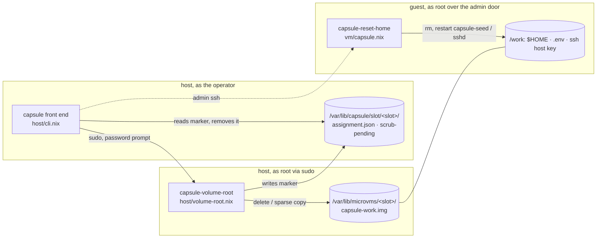
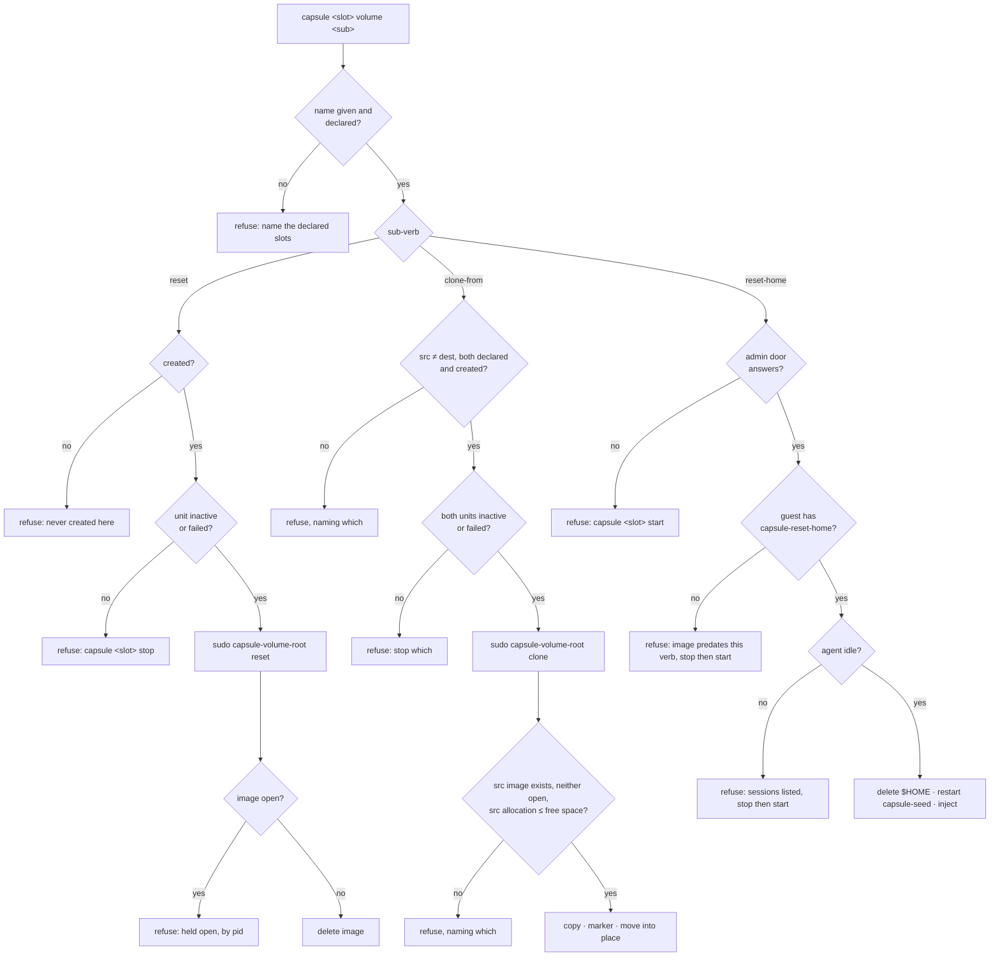

<!-- doctrine:section sec-1 -->
## What changes, and where the boundary sits

**Today** a slot's volume, the ext4 image at
`/var/lib/microvms/<slot>/capsule-work.img` that holds the checkout, `$HOME`, the
caches, `/work/baseline` and the guest's ssh host key, has no commands. Starting
clean (Plan D's S4) is a hand-typed `sudo rm` of that file. Resetting only the
agent's own state (S7) and starting warm from another slot (S5) are not possible
at all.

**After this slice** the front end has three volume commands and status shows
what each volume costs:

| command | slot must be | what it does |
| --- | --- | --- |
| `capsule <slot> volume reset` | stopped | deletes the image; the next `start` makes a cold one |
| `capsule <slot> volume reset-home` | running, nobody working in it | deletes `$HOME` in the guest, then re-injects credentials |
| `capsule <dest> volume clone-from <src> [--identity]` | both stopped | copies `src`'s image onto `dest`; unless `--identity`, the next injection scrubs the source's identity first |
| `capsule all status` | any | gains an allocation column and a free-space line |

The slot name is always explicit. `volume` never resolves to "the slot that is
up", and `all volume` is refused (`DEC-008`).

**Four parts, and what each is allowed to touch.** This diagram shows which
component runs as whom and where it acts. The dotted edge is the only place a
host decision reaches inside a volume, and it goes through a program the guest
already owns.



- **The front end** (`host/cli.nix`) parses the command, requires the name,
  checks the cheap preconditions, and composes the steps. It never deletes
  anything itself.
- **The root helper** (`capsule-volume-root`, new) is the only code that runs as
  root. It is the only code that touches an image file, and it writes the clone's
  scrub marker. Its two state roots, `/var/lib/microvms` and `/var/lib/capsule`,
  are fixed when it is built, so a caller cannot point it anywhere else
  (`DEC-005`).
- **The guest program** (`capsule-reset-home`, new, in the image) is the only
  code that deletes inside a volume. It runs in the guest's own kernel against
  the guest's own filesystem, so the host never parses guest-written bytes
  (`DEC-001`). The paths it deletes come from declarations it already has
  (`DEC-002`, `DEC-003`).
- **The assignment record is not touched** by any of this (`DEC-006`). The marker
  sits in the record's directory but is a separate file with one writer (the
  helper) and one reader (the front end's injection step).

**What does not change:** `setup` is still the only command that assigns a slot.
The perimeter (`POL-001`) gains no guest-side control; `capsule-reset-home` is a
convenience the host invokes, not a security boundary. And volume commands apply
to **module-path slots** only: the devshell capsule's volume is `.vm/capsule/`,
and a slot is a module-path concept.

<!-- doctrine:section sec-2 -->
## Two preconditions, and the order every refusal is checked in

The volume noun carries two opposite preconditions (`DEC-001`, `DEC-004`), and
each refusal names the state it needs and the command that gets there.

**Stopped**, for `reset` and both slots of `clone-from`, means *no process holds
the image open*. It is checked twice, on purpose:

1. The front end refuses unless `microvm@<slot>` is `inactive` or `failed`
   (`unitState`, no root). This is the cheap early message, and it is only a
   stand-in: a unit can read `inactive` while a hand-run runner or a probe holds
   the image.
2. The root helper runs `fuser` on the image **in the same root process,
   immediately before** it deletes or copies. This is the real guarantee. It
   names the file rather than a process, which is the rule
   `mem.fact.oubliette.dead-guest-is-not-a-dead-vm` states for process names.

**Running and idle**, for `reset-home` and the clone's scrub, means *the admin
door answers and `agent` has no logind session other than the serial console's*.

- The console autologins `agent` at boot (`vm/capsule.nix:241`), so "any `agent`
  process" is always true and cannot be the test.
- An ssh login is a session. A baseline is started detached (`setsid`) from one,
  and **assumed** to keep that session in `closing` until it exits, because NixOS
  leaves `KillUserProcesses` off. That assumption is checked by a live exercise,
  not a suite (see Verification).
- The refusal names `capsule <slot> stop` then `start` as the way out. There is
  no `--force`: stopping is cheap and ends every session.

This flowchart gives the refusal order for each command. Every refusal exits
non-zero with a message naming its reason. Nothing is written before the last
check passes.



**Boundary conditions:**

- **`reset` on a slot whose image is already absent succeeds** and says so. A
  reset is a request for a missing image, and one is already missing.
- **`clone-from` onto a slot with no image** is allowed: the destination only
  needs to be created (its state directory exists).
- **The two copies of the front end refuse in different orders**
  (`mem.fact.oubliette.two-copies-refuse-in-different-orders`). The devshell copy
  has no relay socket, so `reset-home` refuses at the door there. That is
  expected, not a defect.
- **The helper re-validates everything the front end checked** except unit
  state: slot names against the pool it was built with, and `src ≠ dest`. It is a
  root program, and it must not trust an argument because a well-behaved caller
  checked it first.

<!-- doctrine:section sec-3 -->
## The root helper: `capsule-volume-root`

**One program, the only one that runs as root, and the only one that touches an
image file** (`DEC-005`). New file `host/volume-root.nix`:

```nix
{
  pkgs, lib,
  capsules,                          # the declared pool: which names are slots
  microvms ? "/var/lib/microvms",    # image root, fixed at build
  moduleState ? "/var/lib/capsule",  # record root, where the marker goes
  imageOwner ? "microvm:kvm",        # what a copied image is chowned to
}: pkgs.writeShellApplication { name = "capsule-volume-root"; ... }
```

All four host-specific values are **build-time arguments with defaults**, so
every real call site gets one store path and a suite builds its own against a
sandbox. **None of them may be a run-time argument**: this program runs as root,
and a later password-less grant (`IMP-010`) must not be pointable at `/`.
`imageOwner` exists because a sandbox cannot `chown` to `microvm`.

**Usage:** `capsule-volume-root reset <slot>` and
`capsule-volume-root clone <src> <dest> [--identity]`.

**Algorithm, `reset`:**

1. Refuse unless `<slot>` is in the pool it was built with.
2. `img=${microvms}/<slot>/capsule-work.img`. If absent, say "already fresh",
   remove any marker, and exit 0.
3. `fuser "$img"`: if anything holds it, refuse and print the pids.
4. `rm -f -- "$img"`, then remove `${moduleState}/slot/<slot>/scrub-pending` if
   present. A fresh volume has no identity to scrub.

**Algorithm, `clone`:**

1. Refuse unless both names are in the pool and differ, the source image exists,
   and the destination's state directory exists.
2. `fuser` on both images (the destination's only if present). Refuse if either
   is held.
3. Refuse unless the source's **allocated** bytes (`stat -c '%b * %B'`) are at
   most the free bytes on the destination directory's filesystem
   (`df --output=avail -B1`). There is no margin: a margin is a number with no
   declared home (`POL-003`).
4. `cp --sparse=always --reflink=never` to `capsule-work.img.clone-$$` **in the
   destination directory**, so the later move is a same-filesystem rename;
   `chown ${imageOwner}`; `chmod 0644`, matching the runner's own images.
5. Unless `--identity`: write `${moduleState}/slot/<dest>/scrub-pending`
   (content: the source slot name and a UTC timestamp, for a human reading it).
6. `mv -T` the temporary file over the destination image. If the move fails,
   remove the marker and the temporary file, then exit non-zero.

**Why the marker is written before the move (step 5 before 6):** the marker must
exist whenever the destination image carries another slot's identity. Writing it
first means the only window where it exists without the new image is a failed
`mv`, and step 6 closes that. A crash between 5 and 6 leaves a marker over the
destination's *own* volume, whose next injection then scrubs its own `$HOME`.
That loses data but can never leak identity, which is the direction to fail in.

**Exit statuses:** 0 done; 1 refused (reason on stderr); 2 usage. The front end
passes the message through unchanged.

**How it is invoked:** the front end runs `sudo <store path>/bin/capsule-volume-root …`,
which prompts for a password on either copy of the front end. No sudoers rule is
added. A future grant would follow `host/proxy-restart.nix`'s one-spelling shape
(`IMP-010`).

<!-- doctrine:section sec-4 -->
## The guest program: `capsule-reset-home`

**The only code that deletes inside a volume** (`DEC-001`), shipped in the guest
image. New file `vm/reset-home.nix`, called from `vm/capsule.nix` and added to
`environment.systemPackages`:

```nix
{
  pkgs, lib,
  home,          # vm/capsule.nix's own binding: "${work}/home"
  scrubPaths,    # absolute paths removed only under --scrub (below)
  tools ? ''     # the one thing tying it to a running guest
    agentSessions() { loginctl list-sessions --no-legend ... }  # sessions of agent, TTY != ttyS0
    restartUnit() { systemctl restart "$1"; }
  '',
}: pkgs.writeShellApplication { name = "capsule-reset-home"; ... }
```

**Where `scrubPaths` comes from** (`DEC-003`), assembled in `vm/capsule.nix`:

```nix
scrubPaths =
  builtins.filter (p: !lib.hasPrefix "${home}/" p)
    (map (i: i.dest) (import ../setup.nix { volumePath = work; }))
  ++ lib.concatMap (k: [k.path "${k.path}.pub"]) config.services.openssh.hostKeys;
```

Destinations under `$HOME` are dropped from the list, because the `$HOME` delete
already covers them. Only the `dest` strings reach the program's text, so editing
a payload's `produce` command does not change the image. For today's
declarations the list is `/work/.env` plus the ed25519 host key and its `.pub`.

**Usage:** `capsule-reset-home [--scrub]`, run as root.

1. `agentSessions`. If it prints anything, refuse with exit status **3** and list
   the sessions (id, TTY, state). The console's `ttyS0` session is excluded,
   because the console autologins `agent` at every boot.
2. `rm -rf -- "${home}"` with **no trailing slash**. If the agent replaced
   `$HOME` with a symlink, only the link is removed. `rm -rf` never follows links
   inside the tree.
3. `restartUnit capsule-seed`. It is a `RemainAfterExit` oneshot, so a restart
   re-runs the seed, which recreates `$HOME` owned by `agent` and re-links the
   config files.
4. Under `--scrub`: `rm -f --` each of `scrubPaths`, then `restartUnit sshd`.
   NixOS's `sshd` regenerates a missing host key when it starts. Restarting it
   leaves established sessions, including the admin session running this
   program, in place. This is **assumed** from `sshd`'s `KillMode=process` and
   checked live.

**Exit statuses:** 0 done; 3 busy; anything else is a failure the front end
reports as-is. The front end reads **127** (command not found) as "this slot's
image predates the verb".

**What it does not know:** what a credential is, what `.doctrine/` is, or which
target is confined (`POL-002`). It deletes a directory the guest module named and
paths two declarations named.

<!-- doctrine:section sec-5 -->
## The clone, and the gate that makes its scrub fail-safe

**A clone is two acts separated in time:** the copy, which needs both slots
stopped, and the scrub, which needs the destination running. The marker is what
connects them (`DEC-011`), and the gate that reads it sits at **the one place
every injection passes through**, the front end's `work()` just before it runs
`capsule-inject`.

This sequence shows a clone from `b` to `d` followed by an ordinary start. The
same gate fires for `capsule d setup …` and `capsule d inject`, because both
reach `work d inject`.

```mermaid
sequenceDiagram
  actor Op as operator
  participant FE as capsule front end
  participant RH as capsule-volume-root (root)
  participant G as guest d (admin door)
  participant INJ as capsule-inject

  Op->>FE: capsule d volume clone-from b
  FE->>FE: names explicit, declared, created; both units stopped
  FE->>RH: sudo … clone b d
  RH->>RH: fuser both · fits · cp sparse · chown
  RH->>RH: write slot/d/scrub-pending
  RH->>RH: mv into place
  FE-->>Op: cost, "clean source not checked", next steps

  Op->>FE: capsule d start
  FE->>FE: systemctl start · wait for door
  FE->>FE: work d inject → marker present?
  FE->>G: capsule-reset-home --scrub
  alt exit 0
    G-->>FE: $HOME, .env, host key gone · seed, sshd restarted
    FE->>FE: remove marker
    FE->>INJ: capsule-inject --capsule d
    INJ->>G: write credentials (nothing exists, so none skipped)
  else busy, missing or failed
    G-->>FE: status
    FE-->>Op: refuse inject, marker kept, reason named
  end
```

**The gate, as a front-end function** (`scrubPending`, called at the top of
`work()` when the verb is `inject`):

```bash
scrubPending() {
  local n="$1" m
  m="$(slotDir "$n")/scrub-pending"
  [ -e "$m" ] || return 0
  echo "capsule $n: this volume was cloned ($(cat "$m")) — scrubbing before inject"
  guestResetHome "$n" --scrub || {
    echo "capsule $n: scrub did not complete, so nothing was injected; the marker stays." >&2
    return 1
  }
  rm -f -- "$m"
}
```

`guestResetHome` is a new function in the existing `guestControl` argument, so a
suite substitutes it exactly as it substitutes `guestHead` today.

**Choices this section makes:**

- **`clone-from` does not start the destination.** It prints the next commands
  (`capsule d start`, then `setup`) and leaves lifecycle to the lifecycle verbs.
  One act per command keeps the failure modes separate.
- **`--identity` writes no marker**, so `inject` skips as it always has, and the
  source's credentials are kept on purpose.
- **The success output says the clean-source rule was not checked** (`DEC-007`)
  and gives the manual recipe until `IMP-008` lands. It also prints the source's
  allocated size and `just reset-known-hosts d`, because the human's own ssh door
  checks host keys strictly and the clone has the source's key until the scrub
  runs.

**Known boundary, stated rather than closed:** running `capsule-inject --capsule d`
straight off `PATH` does not pass through `work()`, so it does not see the
marker. The programs do not know where the record lives, by design
(`mem.fact.oubliette.capsule-state-moves-the-quarantine-not-the-record`).
`capsule` is the human's route, and the module wraps nothing that injects without
it.

**`reset-home` uses the same pieces without a marker:** the front end checks the
door answers, calls `guestResetHome "$n"`, maps 127 and 3 to their refusals, and
on 0 runs `work "$n" inject`. That call also passes the gate, so a clone that was
never scrubbed gets scrubbed here too.

<!-- doctrine:section sec-6 -->
## Status: what a volume costs

`capsule all status` gains an **`alloc`** column immediately after `disk`, and
one line under the table (`DEC-009`).

- **`alloc`**: the image's allocated size, human-readable (for example `3.3G`),
  or `-` if there is no image. It is read host-side with
  `stat -c '%b %B' <image>`, which needs neither root nor the guest: the image is
  `0644` in a `0775` directory. So it is **filled for stopped slots**, unlike
  every guest-observed column. It is the source's high-water mark, which is
  exactly what a clone of that slot would cost.
- **`disk`** keeps its meaning: the guest's `df /work` use percentage, `-` when
  not running. The two headers sit side by side, and `IMP-009` owns the wider
  question of how legible the table is.
- **The free line**, printed after the table and before `perimeter:`:

  ```
  volumes: 108G free on /var/lib/microvms (2 images outside the pool: capsule, capsule-b)
  ```

  The parenthesis appears only when the image root holds state directories that
  are not declared slots. It is how `CHR-013`'s leftovers become visible without
  anyone listing the directory.

**Why the front end's `microvms` becomes an argument:** `host/cli.nix:220`
currently binds `microvms = "/var/lib/microvms"` in a `let`. It becomes an
argument with that default, as `moduleState` already is, so a suite can read
`alloc` and the free line against a fixture root (`POL-004`). Every real call
site takes the default, so both copies of the front end stay one store path.

**No new column that comes and goes:** `alloc` is always printed, and the free
line is always printed (`host/cli.nix:916`'s rule). Only the parenthesis inside
the free line varies, and it describes the host, not a target.

<!-- doctrine:section sec-7 -->
## Front-end surface and seams

**The verb.** `"volume"` joins `ownVerbs` (`host/cli.nix:196`). Its branch
parses one sub-verb:

```
capsule <slot> volume reset
capsule <slot> volume reset-home
capsule <dest> volume clone-from <src> [--identity]
```

`usage()` gains one line under the lifecycle group:

```
  volume:    <slot> volume reset | reset-home | clone-from <src> [--identity]   (name required)
```

**"Name required" means the name came from argv.** The branch refuses when the
name was resolved to the slot that is up, **and also when it came from
`CAPSULE_NAME`**. That variable is ambient to a shell working in a capsule, which
is exactly where someone types a destructive command meaning a different slot.
The front end records `nameFrom=argv|env|resolved` where it already decides the
name (`host/cli.nix:280-303`), and the branch checks it. `all volume` is refused
with the aggregation message the other actions already use.

**Seams, all arguments with defaults, so every real call site is one store path:**

| argument | default | substituted by a suite for |
| --- | --- | --- |
| `microvms` (new) | `"/var/lib/microvms"` | `alloc`, the free line, `created` |
| `volumeControl` (new) | `volumeRoot() { sudo ${volumeRootHelper}/bin/capsule-volume-root "$@"; }` | the root step, without root |
| `guestControl` (existing) | gains `guestResetHome() { … admin ssh … capsule-reset-home "$@"; }` | the guest program's exit status |

`volumeRootHelper` is `host/volume-root.nix` applied to the same `capsules`, and
it is threaded in from `host/programs.nix`, beside the other programs the front
end refers to by store path. `observe` is the precedent.

**Inside the branch, in order:** check where the name came from; check the
sub-verb; run the checks from sec-2 that need no root (`created`, `unitState`,
the door); then exactly one of `volumeRoot reset …`, `volumeRoot clone …`, or
`guestResetHome` followed by `work "$name" inject`. `scrubPending` goes at the
top of `work()` for `inject`, as sec-5 shows.

**Module path:** `host/services.nix` installs the front end already, and its
wrapper supplies defaults without hard-exporting them
(`mem.fact.oubliette.wrap-hard-exports-defeat-the-caller`). This slice adds no
environment variable, so `wrapCases` needs no change. `capsule-volume-root` is
not put on `PATH`: it is reached only through the front end's store path.

<!-- doctrine:section sec-8 -->
## Code impact and verification

**Code impact:**

| path | change |
| --- | --- |
| `host/volume-root.nix` | **new**: the root helper (sec-3) |
| `host/volume-root-cases.nix` | **new**: its suite, built against a sandbox root with `imageOwner` set to the build user |
| `vm/reset-home.nix` | **new**: the guest program (sec-4) |
| `vm/reset-home-cases.nix` | **new**: its suite, with a fixture `home`, fixture `scrubPaths`, and `tools` stubbed |
| `vm/capsule.nix` | builds `scrubPaths` from `setup.nix` and `openssh.hostKeys`; adds the program to `systemPackages` |
| `host/cli.nix` | `volume` verb; `nameFrom`; `microvms`, `volumeControl`, `guestResetHome`; `scrubPending` in `work()`; `alloc` column and free line |
| `host/volume-cases.nix` | **new**: the front end's volume branch against a fixture pool, rendered the way `host/policy-cases.nix` renders its own |
| `host/programs.nix` | builds `volumeRootHelper` and threads it to the front end |
| `flake.nix` | the three suites as outputs, each a short `import` |
| `justfile` | the three suites in **both** `build` and `cases` (`NOTES item 51` step 3) |
| `docs/contract-assignment.md` | line 277: clean-source rule stated as not enforced, owned by `IMP-001` |
| `docs/probes.md` | disk row re-measured |
| `CLAUDE.md` | the suite list in *Working here* names the three new suites |

**Suites and their key cases.** Each refusal is asserted by its **reason** as
well as its status. Each suite is checked by mutating the behaviour it pins and
watching the named case go red.

`volumeRootCases`:
- reset refuses an undeclared name, such as `capsule`
- reset refuses an image held open (a background `exec 3<` on the fixture image) and prints the pid
- reset of an absent image succeeds, says "already fresh", and removes a stale marker
- clone refuses `src = dest`, a missing source image, and a destination with no state directory
- clone refuses when the source's allocation exceeds free space (a fixture filesystem sized to force it)
- clone produces a sparse destination with the fixture owner and mode `0644`
- clone writes the marker unless `--identity`, and removes it again when the final move fails
- **mutation:** move the marker write after `mv` and inject a crash between the two; the "marker before image" case goes red

`resetHomeCases`:
- refuses with status 3 and lists sessions while a non-console session exists; the console session alone does not refuse
- removes `$HOME` and restarts `capsule-seed`, in that order
- a `$HOME` that is a symlink: the link goes, and its target survives
- `--scrub` removes exactly `scrubPaths` and restarts `sshd`; without `--scrub`, neither happens
- **eval-level:** `scrubPaths` for this host contains no path under `$HOME`, and contains `/work/.env` and the host key

`volumeCases`:
- every sub-verb refuses a resolved name and a `CAPSULE_NAME` name, and accepts an argv name
- `all volume` refused; unknown sub-verb refused
- `reset` refuses a running unit before calling `volumeRoot` (the stub's log stays empty)
- `reset-home` maps guest status 127 to "image predates this verb" and 3 to "busy"
- `inject` with a marker: scrub called first, then marker removed, then inject; with a failing scrub, inject is not called and the marker stays
- `alloc` and the free line against a fixture root, including the "outside the pool" parenthesis

**Live exercises, which no suite can reach** (`STD-001`: root, a real image, a real guest):

1. `volume reset` on a finished slot: the image is gone, `start` makes a cold volume, and the `fuser` refusal fires with the unit stopped but the image held.
2. `volume reset-home` on a running idle slot, then with an ssh session open (refused), then with a detached baseline running. **This confirms or refutes sec-2's session assumption.**
3. `volume clone-from` a stopped slot, then `start`. Read back that the scrub ran before inject, that `.env` and the credential files on the clone are this host's, and that `sshd` restarted without dropping the admin session.
4. `capsule all status` shows `alloc` for stopped slots and the free line.

**What this design does not verify:** the password-less grant (`IMP-010`), the
clean-source rule (`IMP-008`, `IMP-001`), and `ISS-009` step 2's composition.

