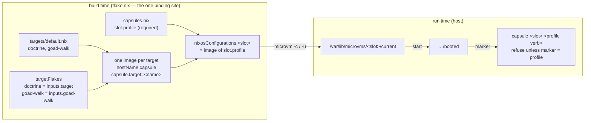
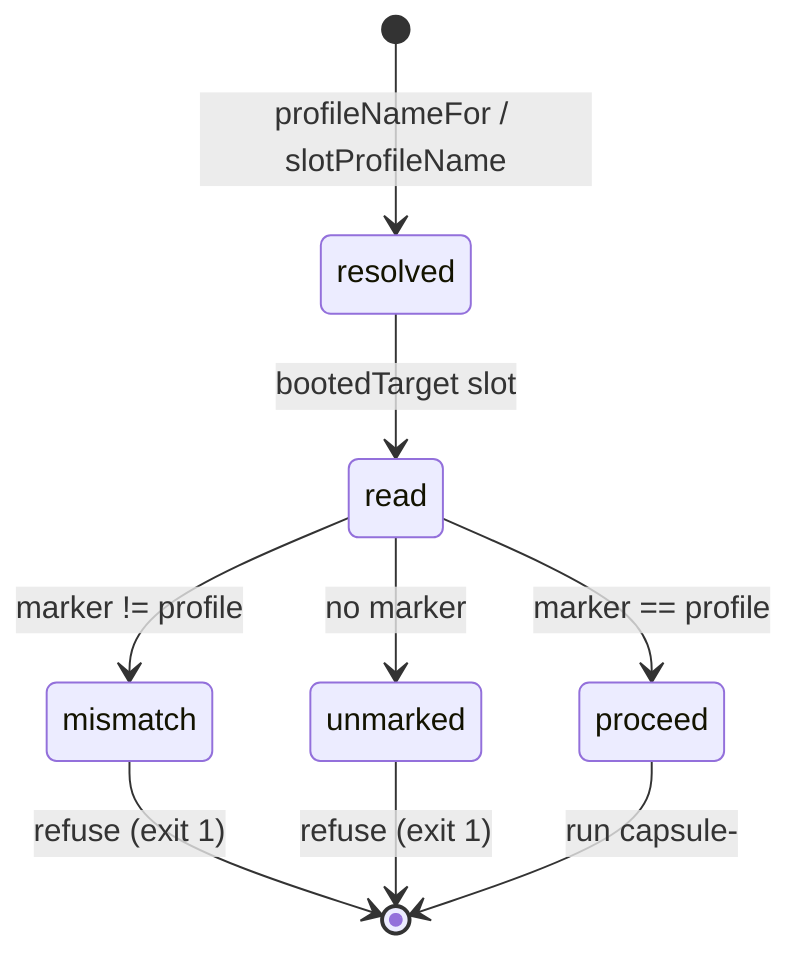

<!-- doctrine:section sec-1 -->
## What changes, and where the boundary sits

**Today** this host builds one guest image, and it is doctrine's. `flake.nix`
binds every declared slot to that one value
(`lib.mapAttrs (_: _: capsuleVm) capsules.instances`, `flake.nix:146`), and
`vm/capsule.nix` reads the single `target.nix` and the single `inputs.target` at
build time (`vm/capsule.nix:170-171`). A slot can be *assigned* a different
project at run time — the profile document is already per-target (`IMP-004`) —
but whatever it is assigned, it boots doctrine's image. `DEC-016` therefore
declares every slot `doctrine`.

**After this slice** the host builds one image per declared target, and each
slot boots the image its declared `profile` names. The first second target is
goad-walk: a flake whose default package is the tool set a goad kit walk runs
with, and whose other target fields are all at their absent values.

Two things make that safe rather than merely possible:

1. **A runner names its own target.** Each image's firecracker config carries
   `capsule.target=<name>` on the kernel command line, so the runner a slot
   actually booted can say which project it is for, without an eval and without
   a program looking anything up.
2. **A profile verb refuses unless the running image names its target.** The
   front end resolves which profile a verb is about exactly as it does today,
   then reads the booted runner's marker and proceeds only on a match. An image
   that cannot say what it is refuses too.



The diagram shows where each fact lives. Everything left of the run-time box
is a value in this repo. The only run-time observation is `booted`, the link
a runner was started from. On the module path microvm.nix writes and removes
it. On the devshell path `vm` writes it under `.vm/<slot>/` (`DEC-024`).

**The boundary.** This slice is per-*slot* and per-*target*. Extras stay
fleet-wide (`CON-001` holds for extras), and per-assignment composition is
`IMP-003`. The fleet's declarations stay in this repo; moving them to a
consumer flake is `IMP-015`, and this slice's job toward it is only to make
`flake.nix` the one place that binds this host's values, so that item becomes
moving one block rather than a rewrite.

**Existing capsules are not preserved.** Every capsule booted before this
slice runs an unmarked image and refuses profile verbs until it is restarted
onto a marked one. That is the user's call (`DEC-023`), not an oversight.

Decisions this design rests on: `DEC-017` (a slot's profile selects its
image), `DEC-018` (targets as an argument), `DEC-019` (a literal input per
target), `DEC-020` (hostName and attributes), `DEC-021` (the marker),
`DEC-022` (read live), `DEC-023` (fail closed), `DEC-024` (the devshell
path's `booted`).

<!-- doctrine:section sec-2 -->
## Targets as a declared set, and the one binding site

### Current behaviour

`target.nix` is one `rec` attrset. `flake.nix:64` imports it as `target`, and
it reaches everything by that single name. The guest gets it through
`mkVm`'s `specialArgs` (`flake.nix:111`). The host programs get it through
three call sites of `host/programs.nix` (devshell `flake.nix:384`, probes
`:1155`, module `host/services.nix:123`). `host/profile.nix` renders it as one
`<name>.json` (`:440-453`). `vm/capsule.nix` pulls the tool set out of
`inputs.target` by name (`:171`).

### Target shape

```
targets/
  default.nix     the list, and the derivation every target shares
  doctrine.nix    today's target.nix, less what is derived or the capsule's
  goad-walk.nix   goad-walk's values (sec-5)
```

`targets/default.nix` is the axis's one home (`POL-003`). It lists targets **by
hand**: a `readDir` would make a stray or untracked file a target. It is also
the one place that derives the per-target values that are functions of a name:

```nix
# targets/default.nix
let
  # Where every capsule's volume is mounted in the guest. The capsule's, not a
  # target's: identical for every target, and guarded by vm/guest-path.nix.
  volumePath = "/work";

  # A target's name is its key here, spelled once.
  derive = name: t:
    t
    // {
      inherit name volumePath;
      guestPath = "${volumePath}/${name}";
      cachePaths = map (dir: "${volumePath}/${dir}") (builtins.attrValues t.caches);
    };
in {
  inherit volumePath;
  byName = builtins.mapAttrs derive {
    doctrine = import ./doctrine.nix;
    goad-walk = import ./goad-walk.nix;
  };
}
```

`targets/doctrine.nix` is today's `target.nix` without `name`, `volumePath`,
`guestPath` and `cachePaths`. It stays `rec`, because `guestConfig` refers to
`caches` and `sizes`. Its commentary on what each field means moves with it and
is not repeated in `goad-walk.nix`: it stays the reference for the field set,
and `docs/contract-target.md` stays the contract.

Every consumer of a single target now names which target it means. **No
consumer takes a default.** A `target` in scope is always
`targets.byName.<name>` for an explicit name, or a function argument.

### Tool-set flakes

A flake input's url must be a literal, so the target values cannot carry
their own flake. `flake.nix` holds the map beside the inputs (`DEC-019`):

```nix
inputs.target.url = "github:davidlee/doctrine/edge"; # doctrine's, name kept
inputs.goad-walk.url = "github:davidlee/goad-walk";

targetFlakes = {
  doctrine = inputs.target;
  goad-walk = inputs.goad-walk;
};
```

`flake.nix` checks at eval that `attrNames targetFlakes == attrNames
targets.byName`, and throws naming the difference either way. A target with
`toolsPackage = null` still has an entry. The map is complete, not optional,
so no consumer has to decide what a missing key means.

### The seam: generic code takes the set as an argument

| file | today | after |
|---|---|---|
| `vm/capsule.nix` | `target`, `inputs.target` from `specialArgs` | `target` and `targetFlake` from `specialArgs`, both one target's; `inputs` no longer read for the tool set |
| `host/profile.nix` | `{pkgs, lib, target}` | `{pkgs, lib, targets}` (`targets.byName`); `dir` holds one document per target |
| `host/programs.nix` | `target` | `targets`; `inject`'s `volumePath` is `targets.volumePath`; `guestRepo` leaves (below) |
| `host/services.nix` | `target` | `targets`, threaded to `programs.nix` |
| `nixosModules.capsule-perimeter` | `import ./host/services.nix {… target …}` | `{… targets …}` |

`flake.nix` is then the only file that knows this host's targets, flakes,
slots and probe subject. That is the precondition `IMP-015` names.

**`guestRepo` moves out of `host/programs.nix`.** Its only consumer is
`probe-netns-boot` (`flake.nix:425, 1077`), and it is a probe fact about one
real target. It is computed in `flake.nix`'s probe block from
`targets.byName.${probeTarget}.guestPath`, where `probeTarget = "doctrine"`
is declared once beside `.#capsule` (sec-3). The other probe preludes
(`flake.nix:1170-1172, 1233-1239`) take the same `probeTarget`.

### `host/profile.nix` over a set

Most of its exports are already independent of the target: `check`,
`fragment`, `select` and `inputs`. What changes:

- `document`/`json` become functions of one target:
  `documentOf :: target -> attrset`, `jsonOf :: target -> path`.
- `dir` is one `runCommand` that renders, checks and copies **each**
  target's document. The build log then lists every target this host declares,
  and one invalid document fails the whole render. That is the right grain,
  because the module installs the directory whole (`services.nix:758-778`).
- `name` (one target's) is replaced by `names`, the list, for
  `profileCases`' first and last cases.
- `needsUnit` becomes `needsUnitOf :: target -> bool`. Its one caller is the
  two-capsules probe prelude, which applies it to `probeTarget`.

`flake.nix`'s `render = t:` for fixtures becomes `render = ts:`, a set, so a
fixture can hold one target or two.

### Invariants

- Only `flake.nix` imports `targets/`, and only `flake.nix` names a real
  target (`doctrine` as `probeTarget` and as `.#capsule`).
- `targets.byName` and `targetFlakes` have the same keys, or eval throws.
- Every derived field (`name`, `volumePath`, `guestPath`, `cachePaths`) is
  computed in `targets/default.nix` and nowhere else.
- `POL-002`'s enumerated list of where a target's name may appear
  (`target.nix`, `inputs.target.url`, a slot's `profile`) is revised at
  reconcile to: `targets/`, `flake.nix`'s inputs and `targetFlakes`, the
  probe subject, and a slot's `profile`.

<!-- doctrine:section sec-3 -->
## One image per target, and a slot bound by its profile

### Images

`mkVm` gains the `specialArgs` a VM needs beyond the fleet's:

```nix
mkVm = hostName: module: args:
  lib.nixosSystem {
    inherit system;
    specialArgs = {inherit inputs net workBranch extras;} // args;
    modules = [microvm.nixosModules.microvm ./vm/common.nix module
               {networking.hostName = hostName;}];
  };

# One image per declared target. Every one is hostName `capsule` (DEC-020).
images = builtins.mapAttrs (name: target:
  mkVm "capsule" ./vm/capsule.nix {
    inherit target;
    targetFlake = targetFlakes.${name};
  })
targets.byName;
```

`hello` is `mkVm "hello" ./vm/hello.nix {}`.

**Every image keeps `hostName = "capsule"`.** The hostname is in the closure
and is the process name `microvm@capsule` (`exec -a "microvm@capsule"` in the
runner). Keeping it the same keeps every VMM matchable by the probes'
`any_vm_running` (`probe/harness.sh:294`), and keeps "a VMM is identified by
its namespace, never by its name" the only rule anything relies on. A
per-target hostname would split that, and a per-slot one is NOTES item 21's
rejected second-image-per-string.

### The marker

`vm/capsule.nix` adds one line:

```nix
# Which target this image is for, readable from the runner a slot booted
# without an eval (host/cli.nix, `bootedTarget`). microvm.kernelParams, not
# boot.kernelParams: it lands in the runner's firecracker config and **not** in
# the guest's toplevel (microvm.nix options.nix:586), so the guest system is
# unchanged by it.
microvm.kernelParams = ["capsule.target=${target.name}"];
```

The name is safe on a kernel command line because `host/profile-name.nix`
already restricts target names to a shape with no whitespace. `vm/capsule.nix`
asserts `profileNameOk target.name` beside its existing guest-path guard, so an
image cannot be built with a marker the reader would split.

This is not item 21's `systemd.hostname=` mistake. That was per-*slot*
identity on the command line, which would force an image per slot. This one is
per-*target* identity, on an image that is already per target.

### Flake attributes

| attribute | value | who uses it |
|---|---|---|
| `nixosConfigurations.hello` | the smoke-test VM | `vm hello` |
| `nixosConfigurations.capsule` | `images.${probeTarget}` (doctrine) | probes, `vm capsule`, `just build-vm` |
| `nixosConfigurations.<slot>` | `images.${slot.profile}` | `microvm -c <slot>`, `microvm -u <slot>` |
| `packages.image-<target>` | `images.<target>.config.microvm.declaredRunner` | `just build` |
| `packages.<slot>`, `packages.capsule` | runners, as today | unchanged |

Images are built through `packages.image-<target>` and are **never**
`nixosConfigurations` attributes (`DEC-020`). So `microvm -c` cannot create a
namespace-less instance of goad-walk's image outside a slot, and `RSK-005`
does not widen. Two slots with the same profile resolve to the same value, so
"one image per target, N slots" is structural in the same way "one image, N
slots" was (`flake.nix:137-145`).

### The binding

`capsules.nix` is unchanged in shape. `recordOf` keeps `profile ? null`
because `guardCases`' fixture builds instances that are not slots. What changes
is that a **declared slot must name a declared target**, and that is checked in
`flake.nix`, the binding site. `capsules.nix` does not import `targets/`
(`DEC-012` alt B: no coupling of the slot file to the target file):

```nix
unbound = lib.filterAttrs
  (_: c: c.profile == null || !(targets.byName ? ${c.profile}))
  capsules.instances;
slotImages =
  if unbound != {}
  then throw "capsules.nix: ${concatStringsSep ", " (attrNames unbound)} \
    declare no profile, or one no target in targets/ is called; \
    a slot boots the image its profile names (DEC-017)"
  else builtins.mapAttrs (_: c: images.${c.profile}) capsules.instances;
```

`capsules.nix`'s `misprofiled` shape check stays. It runs first and
independently of `targets/`.

**What `profile` means changes.** In `SL-001` it was "the operator's
convenience, not a control". For a declared slot it is now also the build
binding. Unassigned slots still resolve to it (`profileNameFor`'s third step,
`host/cli.nix:844-891`), and an assigner is still unconstrained in `profile`
(`contract-assignment.md`, *Who may assign*). An assignment naming a different
target is now refused at use by sec-4's rule, because that slot cannot serve
it. The comments in `capsules.nix:69-84` and `contract-assignment.md:66` are
rewritten to say so.

### Where this code lives

The `images`, `unbound` and `slotImages` code above, together with sec-2's
`targetFlakes` key check, is one function in a new top-level `fleet.nix`:

```nix
# fleet.nix — from this host's declarations to its VMs. Pure: no host values.
{lib, mkVm}: {targets, targetFlakes, capsules, probeTarget}: {
  images = …;        # name -> nixosSystem, one per target
  slotImages = …;    # slot -> images.${slot.profile}, or throw
  vms = {capsule = images.${probeTarget};} // slotImages;
}
```

`flake.nix` applies it once, to this host's values, which keeps `flake.nix` the
one binding site. Because `mkVm` is an argument, a suite can hand it a stub and
pin the throws without building a NixOS system (sec-6). This function is also
what `IMP-015`'s exported builder grows from, so it is named for the fleet and
not for this host.

### Moving a slot between targets

Changing a slot's `profile` changes `nixosConfigurations.<slot>`. The slot
picks the new image up on `microvm -u` (`just refresh-build <slot>`) and a
restart, or on the module's `install-microvm-<slot>` re-pointing `current` at
the next switch (`services.nix:565-593`). On the devshell path, `vm <slot>`
builds `.#<slot>` at every start, so the next start takes the new image. The volume is **not** reset by this:
the last target's checkout, caches and `$HOME` stay (`ISS-009`,
`mem.fact.oubliette.a-provision-resets-tracked-files-only`). Until `ISS-009`'s
refusal exists, re-binding a used slot is `capsule <slot> volume reset` first, which
is an operator step. sec-5 applies it to goad-walk's slot.

<!-- doctrine:section sec-4 -->
## The running image's target, and the refusal

### Current behaviour

A profile verb (`provision`, `collect`, `baseline`, `refresh`, `brief`;
`host/programs.nix:306`) resolves its profile name at one dispatch point
(`host/cli.nix:546-556`): an explicit `--profile`, then the slot's assignment
record, then the slot's declared `profile`, then the only document. Nothing
compares that name with the image the slot is running, because there has only
ever been one image. `ISS-011` is the first place this bites: a re-provision
under another target reads the old target's `guestPath`.

### What is read, and from where

The observation is the link a runner was started from, and each path has one.

- **Module path.** `microvm-set-booted@<slot>` links
  `/var/lib/microvms/<slot>/booted` to `current` before the VMM starts, and
  removes it when the VMM stops (locked microvm.nix,
  `nixos-modules/host/default.nix:254-270`). So `booted` exists exactly while
  the VM is up, and names the runner that is actually running.
- **Devshell path.** There is no unit, so `vm <slot>` makes the same link
  itself (`DEC-024`). It already runs in `.vm/<slot>/`:

  ```bash
  # flake.nix, `vm`. Today: exec nix run "$root#$name"
  nix build --out-link booted "$root#$name"
  exec ./booted/bin/microvm-run
  ```

  `--out-link` also registers the link as a gcroot, so the running image cannot
  be collected under it. Unlike microvm.nix's link, this one is not removed at
  stop: after a stop or a crash it names the image that last booted in that
  directory. The refusal does not mind, because a stopped capsule fails every
  profile verb at the door anyway.

**Nothing is pinned**
(`DEC-022`). The record's `image` field stays `null` and keeps its contract
meaning, a composition store path with a gcroot, for `IMP-003`.

The marker is reached in two hops through the runner, both inside the store and
so both immutable:

```
/var/lib/microvms/<slot>/booted           -> /nix/store/…-microvm-firecracker-capsule
  bin/microvm-run                            exec -a "microvm@capsule" …/firecracker
                                               --config-file /nix/store/…-firecracker-capsule.json
    firecracker-capsule.json                 ."boot-source".boot_args
                                               "… init=/nix/store/…/init capsule.target=goad-walk"
```

Two functions in `host/cli.nix`, beside `created` (`:366`), which already reads
the module path's root:

```bash
# Where the runner this slot is running was started from. The module path's link
# when the capsule has a door, the devshell's otherwise. The door is the half of
# program()'s test that says which path a capsule is on; program() also asks
# whether the module's copy is installed, which is about the host (DEC-024).
bootedOf() {
  if [ -S "$(sockOf "$1")" ]; then
    printf '%s/%s/booted' "${microvms}" "$1"
  else
    printf '%s/.vm/%s/booted' "${CAPSULE_ROOT:-$PWD}" "$1"
  fi
}

# The target the slot's *running* image was built for, or nothing: no VMM up,
# a runner whose layout this does not recognise, or an image built before
# capsule.target existed. Never a guess. Reads the store only, through the
# link the runner was started from, so it is an observation of this host rather
# than a program choosing its own target (item 20). Every step that can fail
# ends in `return 0` or `|| true`: the front end runs under errexit and
# pipefail, so an unguarded failure here would end it with no message instead
# of reaching the unmarked refusal.
bootedTarget() {
  local run cfg
  run=$(readlink -e "$(bootedOf "$1")") || return 0
  cfg=$(sed -n 's/.* --config-file \([^ ]*\).*/\1/p' "$run/bin/microvm-run" | head -n1) || true
  [ -n "$cfg" ] && [ -r "$cfg" ] || return 0
  jq -r '."boot-source".boot_args // ""' "$cfg" 2>/dev/null \
    | tr ' ' '\n' | sed -n 's/^capsule\.target=//p' | head -n1 || true
}
```

A wrong guess of path fails closed. A module-path capsule with no door reads a
devshell link that is normally absent. If one is left over from a devshell run
of the same slot name, the verb still fails at the door, because the devshell
copy of the program cannot reach a tap inside another namespace.

`microvms` is already an argument with a default (`host/cli.nix:96`), and
`socketOf` comes from the `capsules` the suite substitutes (as `volumeCases`
does). So a suite points both branches at a fixture tree (sec-6).

### The rule

At the profile-verb dispatch, **after** the name is resolved and before the
program runs:



The three outcomes and what each says:

| outcome | when | message (stderr) |
|---|---|---|
| proceed | marker equals the resolved profile | none |
| mismatch | marker names another target | `capsule j: runs goad-walk's image, and this verb is for doctrine.` / `  the slot can only serve the target its image was built for (DEC-017):` / `  name --profile goad-walk, or declare j's profile and just refresh-build j.` |
| unmarked | no `booted`, unreadable runner, or no `capsule.target` | `capsule c: its running image does not name a target —` / `  not running, or booted before capsule.target existed.` / `  start it, or restart it onto the current image (module path: just refresh-build c first).` |

**Unmarked refuses** (`DEC-023`). An image that cannot say what it is has no
claim to be acted on. The cost is that every capsule running today refuses
until restarted, and that cost was accepted. "Not running" and "unmarked" are
one outcome because every profile verb talks to the guest, so a stopped slot
would fail anyway. The message names both causes, not a guess between them.

**The name compared is the resolved one**, from whichever step produced it. So
the same rule covers:

- an explicit `--profile` naming the wrong target, which is `ISS-011`'s
  re-provision; it is **closed by refusal**, and the stale `guestPath` read is
  never reached;
- an assignment record naming a target the slot's image isn't for (an assigner
  is unconstrained in `profile`, and this is where that meets the build);
- a slot whose declaration changed but which hasn't been refreshed onto the new
  image. That is the case `IMP-012` insures against and `IMP-013` will later
  report without being asked.

### Where it lives, and where it does not

In the front end only, at the one dispatch point, so every profile verb gets it
and none can skip it. The `capsule-<verb>` programs off `PATH` are not checked:
they are handed a profile and never resolve one (item 20), and "a branch
reachable through the front end is not reachable off `PATH`"
(`mem.fact.oubliette.two-copies-refuse-in-different-orders`). That is the
existing arrangement for every front-end refusal, and this design does not
change it.

`status` does not call `bootedTarget` in this slice. Showing the running
target beside the declared one is `IMP-013`'s column, which reads the same
function.

### Dependency on microvm.nix's layout

The reader depends on two facts about microvm.nix's firecracker runner: that
`microvm-run` names its config with `--config-file`, and that the config
carries `boot-source.boot_args`. If either moves, `bootedTarget` prints
nothing and every profile verb refuses as unmarked, so it fails closed and
says so. The case suite pins the layout by reading a fixture copied in the
same shape, and `hostModuleUnits`, which evaluates the module against the
locked microvm.nix, is where a real runner's shape is available to check.
Whether to add that check is a plan question (sec-6).

<!-- doctrine:section sec-5 -->
## goad-walk, the second target

### Its values

goad-walk's walk is stdlib-only ruby, building a new script against an SDK
and test harness that come with the tool set. Nothing is prebuilt and nothing
is cached. Every field that has an absent value takes it, **spelled as a
value**: `vm/capsule.nix` reads `toolsPackage`, `extraTools`, `caches`,
`guestConfig` and `commands` without an `or`, so an omitted key is an eval
error. `contract-target.md:83-96` already defines each absent path as a value.

```nix
# targets/goad-walk.nix — a goad kit walk. The capsule clones this repo, not
# goad's, so a walking agent sees the kit and the binaries and nothing else of
# goad (goad docs/slices/012).
{
  path = "/home/david/dev/goad-walk";
  toolsPackage = "default"; # goad, goad-emit, ruby, jq (+ goad-check, goad-kit)
  extraTools = [];
  caches = {};
  guestConfig = {};
  commands = "";
  baseline = null;
  refresh = null;
  # statePaths, stateMaxBytes: omitted — no out-of-band state (profile.nix `or`).
  sizes = {
    vcpu = 2;
    mem = 2048;
    volume = 8192;
  };
}
```

**Sizes** are chosen for goad-walk, not copied from doctrine (NOTES item 23;
`plan-d-fleet.md` L2). A ruby script and its harness need neither cargo's 6 GiB
nor its 32 GiB volume. `volume` is fixed at a volume's first boot, which is one
more reason goad-walk takes a slot with its volume reset (below).
These figures are a starting point, not a measurement, and the first real walk
is where they get checked.

This takes `RSK-002`'s `caches = {}` and `guestConfig = {}` branches for the
first time with a real target, at the **build** rung. The **start** rung is the
human boot below.

### Its slot, and its policy

goad-walk takes **one** declared slot: `j`, the highest index, chosen because
nothing in the design depends on which. `j`'s `profile` becomes `goad-walk`.
`j` has never been created on this host (no `/var/lib/microvms/j`,
2026-09-30), so it has no volume and no doctrine residue can cross (`ISS-009`).
If it is created before this lands, it gets `capsule j volume reset` before
its first start under goad-walk. `j`'s
policy stays `build`, the declared default for every slot. Egress for a
future language's package source is a policy change and not this slice
(NOTES item 36).

`DEC-016` is superseded at reconcile by a decision recording the split, citing
NOTES items 21, 28, 51 and 52 in prose, since the ledger takes no new edges
(`ADR-002`).

### Preconditions (the user's)

The image cannot be built until goad-walk's input is fetchable (`ISS-015`
shape):

1. goad's `main` pushed. It was 57 commits ahead of `origin` on 2026-09-30.
2. goad-walk's `inputs.goad.url` changed from `git+file:///home/david/dev/goad`
   to `github:davidlee/goad`, its `flake.lock` committed, and goad-walk pushed
   to `github:davidlee/goad-walk`.
3. If either is private, fetch credentials wherever the image is built.
4. `~/flakes` adds `inputs.goad-walk.follows = "nixpkgs";` beside
   `inputs.target.follows` (`~/flakes/flake.nix:128`), because it locks
   oubliette and never evaluates the guest
   (`mem.fact.oubliette.flakes-builds-this-repo-two-ways`).

Everything in sec-2 to sec-4 builds and is tested without goad-walk. The
`targets/` and `targetFlakes` entries for goad-walk land last, once 1–2 hold.

### What the human boot must show

Both directions, since a presence-only check passes for the wrong reason
(`ADR-003`):

- `capsule j start` and a profile verb under goad-walk proceed, and the same
  verb with `--profile doctrine` refuses as a mismatch;
- in the guest, `goad`, `goad-emit`, `ruby` and `jq` are on `PATH`, and **no
  goad source is present**: the checkout at `/work/goad-walk` is goad-walk's,
  and a search of `/nix/store` for goad's source tree finds nothing;
- the motd names goad-walk.

<!-- doctrine:section sec-6 -->
## Code impact and verification

### Code impact

| path | change |
|---|---|
| `targets/default.nix` (new) | the list, `volumePath`, `derive` (sec-2) |
| `targets/doctrine.nix` (new) | today's `target.nix` less the derived fields and `volumePath`; commentary moves with it |
| `targets/goad-walk.nix` (new) | sec-5's values; lands last, once goad-walk is fetchable |
| `target.nix` | deleted |
| `fleet.nix` (new) | `{lib, mkVm}: {targets, targetFlakes, capsules, probeTarget}: {images, slotImages, vms}`, with the key check and the `unbound` throw (sec-3) |
| `flake.nix` | `inputs.goad-walk`; `targets = import ./targets`; `targetFlakes`; `probeTarget = "doctrine"`; `mkVm` takes extra `specialArgs`; `vms` from `fleet.nix`; `packages.image-<target>`; `render = ts:`; every `target` consumer names its target or takes the set; probe preludes and `guestRepo` from `probeTarget`; `resetHomeCases` over every image; `fleetCases` wired; `vm` builds with `--out-link booted` and execs the link (`DEC-024`) |
| `vm/capsule.nix` | takes `targetFlake` instead of reading `inputs.target`; `microvm.kernelParams = ["capsule.target=…"]`; asserts `profileNameOk target.name` |
| `host/profile.nix` | `{…, targets}`; `documentOf`, `jsonOf`, `needsUnitOf`; `dir` renders every target; `names` replaces `name` |
| `host/programs.nix` | `targets` in place of `target`; `inject` uses `targets.volumePath`; `guestRepo` removed |
| `host/services.nix` | `targets` in place of `target`; option text for `profileDir` unchanged in meaning |
| `host/cli.nix` | `bootedOf` and `bootedTarget`; the refusal at the profile-verb dispatch (`:546-556`) |
| `capsules.nix` | `j.profile = "goad-walk"` (last); comments at `:7-10, :69-84, :156-160` rewritten for one image per target |
| `host/profile-cases.nix` | takes `names`/`dir` of a set; fixtures via `render` over sets |
| `host/policy-cases.nix` | the refusal cases below, over a fixture `microvms` tree, a fixture `CAPSULE_ROOT` and a substituted `socketOf` |
| `fleet-cases.nix` (new) | the binding's throws, over a stub `mkVm` |
| `vm/reset-home-cases.nix` | takes every image's config and asserts the scrub list per image |
| `justfile` | `build-vm` builds every `image-<target>`; `cases` and `build` list `fleetCases`; `nix_paths` gains `targets/`, loses `target.nix`; `_target` removed if still uncalled |
| docs | `contract-target.md` (a target is a file in `targets/`, and porting adds "declare it and bind a slot"), `contract-assignment.md` (`profile` binds for a declared slot; `image` unchanged), `README.md` ("Pointing it at a different repo", "A second capsule…", "Changing the guest's tools"), `CLAUDE.md` (the one-image lever becomes one image per target; `target.nix` references) |

Governance edited at reconcile, not in the code phases: `POL-002`'s name list,
`POL-003`'s rows, `CON-001` narrowed to extras, `DEC-016` superseded,
`IMP-012`/`IMP-006`/`ISS-011`/`RSK-002` updated, and the `*State:*` headers of
ledger items 21, 28, 51 and 52.

### Test cases

**`policyCases`: the refusal** (run; a fixture `microvms` root with a runner
tree in microvm.nix's shape: `bin/microvm-run` naming `--config-file`, and a
config JSON with `boot-source.boot_args`. Cases 1–7 and 9 give the slot a door,
through a socket at the substituted `socketOf` path, so they take the module
branch. Case 8 gives it none):

1. *a profile verb proceeds when the booted image names the resolved profile*
2. *a mismatch refuses, naming both targets*: marker `goad-walk`, declared
   `doctrine`
3. *an explicit `--profile` naming another target refuses* (`ISS-011`'s shape)
4. *an assignment record naming another target refuses*
5. *an unmarked runner refuses as unmarked*: config with no `capsule.target`
6. *a slot with no `booted` refuses as unmarked*
7. *a runner whose `microvm-run` names no `--config-file` refuses as unmarked*
8. *a capsule with no door reads its devshell link*: the marker sits under
   `$CAPSULE_ROOT/.vm/<slot>/booted` and the verb proceeds, while a conflicting
   marker under the `microvms` root is ignored
9. *a config that is not JSON refuses as unmarked* and does not end the front
   end silently: the reason is on stderr

Each asserts the reason as well as the status. Mutation checks: delete the
dispatch check and watch 2–7 and 9 go red; swap `bootedOf`'s branches and
watch 1 and 8 go red; drop `bootedTarget`'s `|| true` and watch 9 go red.

**`fleetCases`: the binding** (eval throws read with `builtins.tryEval` and
asserted in the shell, `hostModuleUnits`' arrangement; a stub `mkVm` returns
its arguments):

1. *a slot whose profile names no target throws, naming the slot*
2. *a slot with no profile throws*
3. *`targetFlakes` missing a target throws; an extra entry throws*
4. *two slots with one profile get the same image value* (structural sharing)
5. *each image is given its own target and its own flake*: `specialArgs.target.name`
   and `specialArgs.targetFlake` per image
6. *`vms.capsule` is the probe target's image*

**`profileCases`**: *the render holds one document per target*, and *one
invalid document fails the whole render*. The existing first and last cases are
re-pointed at `names`.

**`resetHomeCases`**: the scrub list contains `${volumePath}/.env` in **every**
image. This puts one guest eval per target into `just build`.

**Build**: `just build-vm` builds `image-doctrine` and, once it lands,
`image-goad-walk`. That build is the first time `caches = {}` and
`guestConfig = {}` are taken by a real target (`RSK-002`, build rung).

### Evidence, by verb (`STD-001`)

| claim | verb | how |
|---|---|---|
| the binding throws on an unbound slot or a mismatched flake map | trigger | `fleetCases` |
| the refusal's three outcomes, and `ISS-011` closed | run | `policyCases`, on a fixture tree |
| a real runner carries the marker where `bootedTarget` looks | take | `jq` over `image-doctrine`'s firecracker config after `just build-vm`; recorded in the phase notes |
| every image builds, goad-walk's with its absent values | build | `just build-vm` |
| goad-walk boots, a verb under it proceeds, one under doctrine refuses | start | VH: the user's `capsule j start` |
| goad's tools are present and goad's source is absent | exercise | VH, both directions (sec-5) |

**Not exercised by this design:** `vm` writing its link at a real devshell
start. The `vm` text is built, so shellcheck checks it, and case 8 runs the
reader over the link's shape, but no devshell capsule is started. Nor is the
refusal run against a *live* mismatched
slot. That would need a slot re-declared and deliberately not refreshed. The
fixture covers the logic, and the live case is left to the first real
occurrence, which `IMP-013` would report. The second image's erofs size is not
measured here; if it is taken, it goes in `docs/probes.md` (`ADR-003`).

### Order of work (for the plan, not binding here)

1. the refusal and `bootedTarget` with the marker on doctrine's image, while
   there is still one target;
2. `targets/` and `fleet.nix`, with doctrine as the only entry, and every
   consumer moved to the set;
3. goad-walk declared and `j` bound, once the preconditions in sec-5 hold.

Step 1 alone already makes every existing capsule refuse until it is
refreshed. That is accepted.

